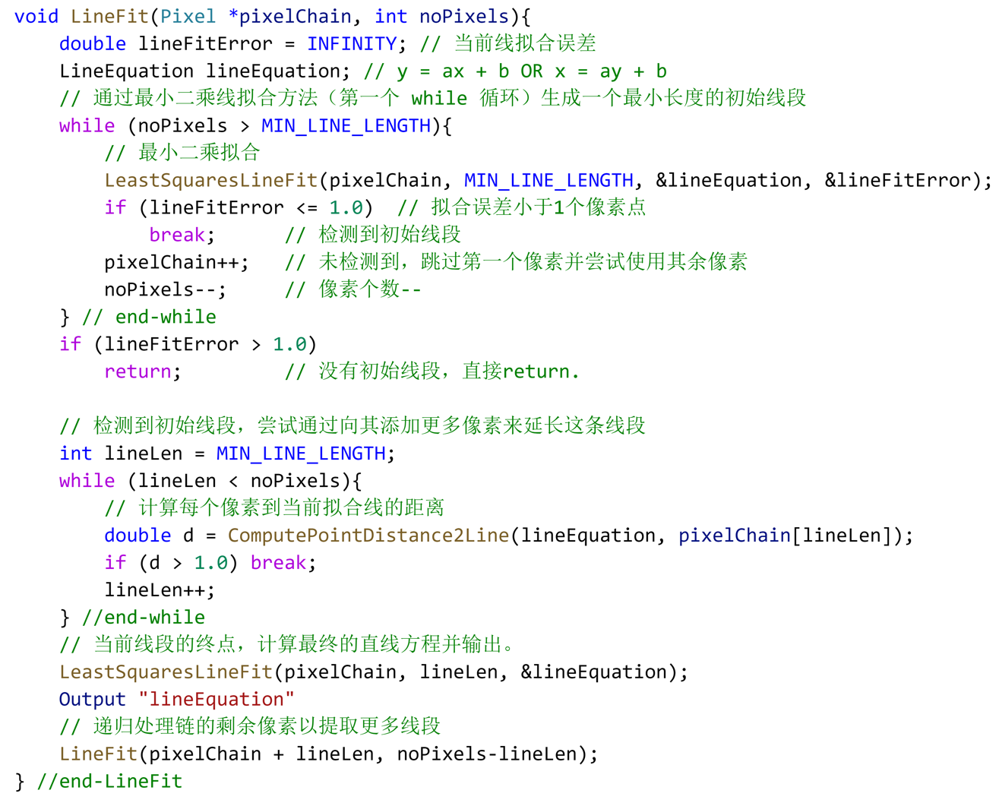

# EdgeDrawing

它不是直接应用不同的滤波器和阈值来进行边缘检测，而是先计算图像中的一组锚点，然后在这些锚点之间画出边缘。结果的边缘图由连续的1像素宽的边缘组成，具有真实的连通性。与传统方法相比，这种方法能够更准确地捕捉图像中物体的边界，并且具有更高的运行效率

通过应用Sobel算子来确定图像中的边缘区域和边缘方向。在这一步骤中，我们对平滑后的图像的每个像素都应用Sobel算子，并获得两个梯度值Gx和Gy。然后，我们使用Gx和Gy来确定边缘区域和边缘方向：如果Gx + Gy大于给定阈值，则将该像素标记为“边缘区域”像素，否则将该像素标记为“非边缘区域”像素。我们还计算边缘的方向，如下所示：如果Gx >= Gy，则假设该像素处有一条“垂直边缘”；否则假设该像素处有一条“水平边缘”。图1显示了我们的测试图像在阈值为36的情况下对应的边缘区域。白色边缘区域对应于Gx + Gy >= 36的像素。黑色像素被抑制为非边缘像素。

在计算边缘区域和方向后，您提出的算法继续计算边缘区域内的一组“锚点”像素，作为最终的“边缘绘制”过程的支点。为了实现这一目标，我们只需按行顺序对边缘区域图像进行光栅扫描，并将极值标记为我们的锚点。在这一步骤中，用户可以选择最终边缘图中的细节数量。我们定义了一个我们称为“细节比例”的概念，用于确定选择多少个边缘锚点。开始链接过程时有更多的锚点，最终的边缘图中就会有更多的细节。因此，如果您只对获得图像中的主要（长）边缘感兴趣，您可以指定一个较大的细节比例，例如大于10的值。但如果您想在边缘图中包含更多细节，您可以指定一个小的细节比例，如1，2，3，4等。

LSD(Line Segment Detector)是一种基于霍夫变换的线段检测算法。它首先对图像进行高斯平滑，然后在平滑后的图像中提取边缘，再对提取出的边缘进行霍夫变换，从而检测出图像中的线条。

EDLine算法是一种基于梯度的线特征提取方法。它首先对图像进行高斯平滑，然后计算图像的梯度图像，再在梯度图像中提取锚点，最后以锚点为起点沿着梯度方向向两边链接，从而检测出图像中的线条。

由于EDLine算法没有使用霍夫变换，它比LSD速度更快。同时，由于EDLine算法没有依赖于边缘提取的结果，它也更加稳定。

**EDLine的优点？**

1. 更快的处理速度。EDLine算法没有使用霍夫变换，它比LSD速度更快。
2. 更好的稳定性。由于EDLine算法没有依赖于边缘提取的结果，它更加稳定。
3. 更少的参数设置。EDLine算法只需要设置两个参数（梯度阈值和每次扫描的间隔），而LSD算法需要设置更多的参数，比如边缘检测的阈值、霍夫变换的精度等。
4. 更简单的实现方式。EDLine算法的实现方法更简单，它没有使用霍夫变换等复杂的算法，因此实现起来更加容易。

EDLine算法的基本流程如下：

1. 对图像进行高斯平滑，以去除噪声。
2. 计算图像的梯度图像，并利用阈值过滤掉梯度值较小的像素。
3. 提取梯度图像中的锚点。
4. 以锚点为起点，沿着梯度方向向两边链接，形成线条。

EDLine算法的缺点在于它只能检测水平或竖直的线条，不能检测斜率较大的线条。（它依赖于图像边缘连续性来检测线段。斜率较大的直线在图像中会被拆分成多个小段，这样EDLine就无法将它们当做一个整体的直线来检测。）

为了提高EDLine算法的性能，可以对它进行优化。例如，可以调整每次扫描的间隔，在需要时加快扫描速度，以提高检测精度。也可以通过提高梯度阈值，减少梯度图像中的噪声，以提高检测精度。

可以通过以下方法来改进这个缺点：

- 尝试不同的梯度阈值，看看哪个阈值能够最好地检测斜率较大的线条。
- 调整每次扫描的间隔，在需要时加快扫描速度，以提高检测精度。
- 通过提高梯度阈值，减少梯度图像中的噪声，以提高检测精度。

EDLine锚点的详细实现步骤:

1. 计算图像的水平梯度和垂直梯度。通过Sobel算子或其他方法，对图像进行水平梯度和垂直梯度的计算，分别存储在dxImg和dyImg图像中。
2. 计算梯度幅值和方向。首先通过绝对值函数，计算水平梯度和垂直梯度的绝对值，并存储在dxABS和dyABS图像中。然后计算梯度幅值，即水平梯度和垂直梯度的平方和的开根号，并存储在gImg图像中。同时，计算梯度方向，并存储在dirImg图像中。
3. 寻找梯度幅值大于阈值的像素。通过阈值函数，找到梯度幅值大于设定阈值的像素，存储在edgeImage图像中。
4. 采样图像，寻找锚点。EDLine算法采用采样算法，对图像进行采样，只处理采样后的图像。采样时，找到图像中梯度幅值大于阈值的像素，并根据梯度方向，选择合适的锚点。
5. 在锚点周围寻找满足要求的线条。从锚点开始，沿着梯度方向不断寻找线条。寻找时，需要满足一定的阈值要求，如梯度幅值大于阈值，梯度方向相同等。如果找到满足要求的线条，则将它们存储在EdgeChains结构中。
6. 根据线条的结构，对线条进行后处理。线条的结构通常不太完整，可能存在分叉，断点等情况。EDLine算法通过后处理来改善线条的结构。通过对线条进行分段、合并、拟合等操作，可以得到更加完整的线条。
7. 最后，根据需要，可以对线条进行描述，并存储线条的一些特征信息，如长度、宽度、端点坐标等。这些特征信息可以用于图像处理的后续步骤，如目标检测、图像分类等。

---

图 4 给出了链接过程的细节。红色框内的数字表示该像素的梯度值，即 Gx + Gy。 3个锚点用红色圆圈标记。假设我们从中间的锚点开始。当我们向上移动时，我们只需查看北部的 3 个相邻像素，然后转到具有最大值的像素。具体来说，如果你在向上移动的像素 (i, j) 并且通过 (i, j) 的边缘是垂直边缘，那么我们看像素 (i-1, j-1), (i-1, j ), (i-1, j+1) 并简单地转到具有最大值的那个。这个链接过程让我们越过真正的边缘（用黄色圆圈标记），直到我们到达下一个锚点。类似地，当我们从锚点向下时，我们查看南边的 3 个相邻像素，即 (i+1, j-1)、(i+1, j) 和 (i+1, j+1 )，然后转到具有最大值的那个。这将我们带到南边的下一个锚点。链接过程中绘制的实际路径以黄色圆圈显示。请注意，链接过程绘制了一个完美的连续 1 像素宽的边缘。如果边缘是水平的，那么我们就会在锚点的右侧（东）和左侧（西）追踪一条路径。具体来说，从 (i, j) 向左，我们将查看像素 (i1, j-1)、(i, j-1) 和 (i+1, j-1) 并转到具有最大值的像素.类似地，从 (i, j) 开始，我们将查看像素 (i-1, j+1)、(i, j+1) 和 (i+1, j+1)，然后转到具有最大值。

# EDLine原理

在本文中，我们提出了一种快速、无参数的线段检测器，名为 EDLines，它可以产生稳健而准确的结果，并且运行速度比已知最快的线段检测器（ LSD）快 11 倍。我们的检测器还包括一个线验证步骤，它可以控制错误检测的数量。

EDLines 由三个步骤组成：

(1) 给定灰度图像，我们首先运行我们的快速、新颖的边缘检测器，即边缘绘制 (ED) 算法，它产生一组干净、连续的像素链，我们称之为边缘段。边缘段直观地对应于对象边界。 

(2) 通过最小二乘线拟合方法，从生成的像素链中提取线段。

 (3) 最后，根据亥姆霍兹原理的线验证步骤用于消除错误的线段检测。

## 边缘检测

给定一张灰度图像，ED 分四个步骤进行边缘检测：

1. 首先将图像通过一个滤波器，例如高斯滤波器，以抑制噪声并平滑图像。默认情况下，我们使用 $\sigma =1 $ 的 $5\times 5$ 高斯内核。
2. 下一步是计算平滑图像每个像素的梯度大小和方向。在此步骤中可以使用任何已知的梯度运算符，例如 Prewitt、Sobel、Scharr 等。
3. 计算一组像素，称为锚点，这些像素很可能是边缘元素 (edgels)。锚对应于梯度算子产生最大值的像素，即梯度图的峰值。
4. 最后，我们通过在它们之间画边来连接第三步中计算出的锚点；

## 线特征提取

给定由连续的边缘像素链组成的边缘段，此步骤的目标是将该链分成一个或多个直线段。基本思想是依次遍历像素，并使用最小二乘线拟合方法将线拟合到像素，直到误差超过某个阈值，例如 1 个像素误差。当误差超过这个阈值时，我们生成一个新的线段。然后该算法递归地处理链中剩余的像素，直到处理完所有像素。

表 1 显示了用于从像素链中提取线段的算法。想法是通过最小二乘线拟合方法（第一个 while 循环）生成一个最小长度的初始线段，然后通过向其添加更多像素来扩展该线段（第二个 while 循环）。最小行长度的值取决于线段验证参数，并在第 5.4 节中进行了解释。在检测到最小长度的初始线段后，我们简单地遍历链的剩余像素并计算每个像素到当前拟合线的距离。只要像素与当前行在一定距离内，我们就将像素添加到当前行，例如，1 个像素误差。直觉上，我们将继续向当前线段添加像素，直到我们转过一个角并且线的方向发生变化。那时，我们输出当前线段。然后递归处理链的剩余像素以提取更多线段。

## 线段验证

> 使用长度印制，而不是线段验证

类似于 Desolneux  和 LSD，我们的线验证方法基于亥姆霍兹原理，它基本上说明了对于图 2 的结构具有感知意义，偶然对这种结构（分组或格式塔）的期望必须非常低。这是一种  “a contrario” 的方法，其中对象被检测为背景模型的异常值。正如 Desolneux 等人所示，一个合适的背景模型是所有像素（梯度角）都是独立的。他们表明，最简单的此类模型是高斯白噪声。为了通过 Helmholtz 原理进行具体验证，Desolneux 定义了线段的 ”‘Number of False Alarms (NFA) “，如下所示：设 A 是长度为 “n” 的线段，在大小为 $N\times N$ 像素的图像中，至少''k''个点的方向与 A 的方向对齐。将 A 的 NFA 定义为：
$$
NFA(n,k) =N^4\cdot \sum^n_{i=k}
\left( \begin{array}{c}
	n\\
	i\\
\end{array} \right) 
p^i(1-p)^{n-i}
$$
其中 $N^4$ 表示  $N\times N$  图像中潜在线段的数量。这是由于一条线段有两个端点，每个端点可以位于图像的 $N^2$ 个像素中的任意一个，因此总共有 $N^2\times N^2= N^4$  个线段。用于计算二项式尾部的概率“p”是线方向的准确性。

一条线段，如果它的 $NFA(n,k)\le\varepsilon$ 被称为 $\varepsilon-meaningful$；Desolneux  建议将 $\varepsilon$ 设置为 1，这对应于每幅图像一次错误检测。给定这些定义，我们按如下方式验证我们的线段：对于长度为“n”的线段，我们计算沿线段的每个像素的梯度角并计算对齐像素 “k” 的数量。然后我们计算 $NFA(n, k)$，如果 $NFA(n,k)\le\varepsilon$ 则接受线段有效；否则该行被拒绝。需要指出的是，我们按照 “a contrario” 框架的要求，在原始未过滤图像的验证步骤中执行梯度计算。

我们还要指出，线段验证是 EDLines 中可选的最后一步，如果认为不必要，可以省略。 我们观察到，线路验证仅拒绝短线段。 长线是与背景的大偏差，永远不会被拒绝。 因此，一个只使用长线的应用程序。例如，**立体匹配，可完全跳过经由亥姆霍兹原理的线验证**，并且使用基于可更快地测试的原理的线验证方法，例如，拾取长于特定阈值的线。 这将进一步加快 EDLines。

## 参数设定

### 梯度大小和方向计算

为了计算像素 $(x,y)$ 处的梯度幅度和水平线角，我们遵循Burns等人 (1986) 和Desolneux等人 (2008) 和LSD (Grompone von Gioi等人，2010; LSD)，并使用 $2\times 2$  掩模如下:
$$
g_x(x,y)=\frac{I(x+1,y)-I(x,y)+I(x+1,y+1)-I(x,y+1)}{2}\\
g_y(x,y)=\frac{I(x,y+1)-I(x,y)+I(x+1,y+1)-I(x+1,y)}{2}\\
g(x,y)=\sqrt{g_x(x,y)^2+g_y(x,y)^2}\\
angle(x,y)=arctan\left(\frac{g_x(x,y)}{-g_y(x,y)}\right)
$$
其中，$I(x,y)$ 是输入图像在像素 $(x,y)$ 处的强度， $g(x,y)$ 是梯度幅度，角度 $angle(x,y)$ 是水平线角。`Grompone von Gioi` 等人 (2010) 的作者指出，使用这种简单的梯度算子的原因是为了减少计算出的梯度的依赖性，从而尽可能地保持像素独立性; 因为，由于亥姆霍兹原理，“相反” 验证需要像素独立性。

### 线特征验证参数

我们的直线验证基于直线段的长度和直线上对齐的像素数。要应用此定义,我们需要定义"对齐"的含义。我们借鉴了Desolneux等人的定义。两个点（或线段）$P$ 和 $Q$ 具有相同的方向即对齐，如果 $angle(P)$ 和  $angle(Q)$  在 $\pi/n$ 度以内，则精度为 $1/n$。Desolneux 还指出，与Pyschophysics 和数值实验一致，"n" 不应超过8""。Burns 和 LSD 等 也得出了同样的结论。因此，我们假设两个点（或一个点和一个线段）如果它们的角度在彼此的 $\pi/8=22.5°$ 以内就对齐了。这对应于 8 个不同的角度取向和一个精度 $p=1/8=0.125$。这是 $NFA$ 计算中使用的概率。

### 梯度阈值、锚定阈值和扫描间隔

在ED中的梯度计算之后，在anchors的计算和链接过程中，梯度值小于某个阈值 $\rho$ 的像素将被忽略。这让我们可以消除绝对可能不包含边缘元素（edgels）的像素，因此也没有线段。

在 Gromponevon Gioi 等人的讨论之后。我们设置 $\rho$ 以便忽略角度误差大于角度容忍度的点。两个连续像素之间的最大量化误差等于 2（当相邻像素的误差为 +1 和 -1 时发生），角度容差为 22.5°（参见第 5.2 节），我们通过以下公式计算梯度阈值:

$$
\rho = \frac{2}{sin(22.5)}=5.22
$$
遍历梯度图并消除梯度值小于 $\rho$ 的像素，我们得到我们所说的图像的“边缘区域”。这些是边缘可能位于的像素。此外，消除的像素中没有一个可能包含边缘。

ED还有两个参数：锚阈值和扫描间隔。 如第2节所述，在阈值梯度集群计算后，称为边缘区域， ED计算一组锚 ，它使用智能路由程序连接，以获得最终边缘段。 目前，ED通过具有阈值的非最大抑制执行锚计算，称为锚阈值（Anchor Threshold）。经典的非极大值抑制认为如果一个像素的梯度值大于或等于该像素在梯度方向上的两个相邻像素，则该像素为边缘候选，而ED 认为，按锚点阈值的量，如果一个像素的梯度值在梯度方向上比它的两个邻居都大 ，该像素是一个锚点。

计算锚定的阈值是为了选择高质量的锚定，因为这有助于提取高质量的边缘段。 没有为锚点阈值设置最佳值的理论依据；选择纯粹是经验性的。 因此，在EDLine中对许多不同类型的图像进行了多次实验后，我们得出结论，锚点阈值为 3 会产生优质的边缘段，从而产生优质的线段。 ED的其他参数（扫描间隔）用于选择不同行/列间隔的锚点。 此参数的目标是调整锚点的数量，从而调整最终边缘贴图中的细节量。

使用 “k” 的扫描间隔，ED 扫描每第 k 行/列以查找锚点。因此，扫描间隔为 1 意味着，ED 每一行/列扫描一次，即每个像素；扫描间隔为 4 意味着，ED 每 4 行/列扫描一次。随着锚点数量的减少，最终边缘图中的细节也会减少，反之亦然。由于我们要检测给定图像中的所有线段，因此我们希望 ED 生成包含图像中所有细节的边缘图；因此，我们在 EDLines 中将 Scan Interval 设置为 1。

### 线特征拟合参数

由两个参数与线段拟合的像素链相关： (1)最小线长 (2)最大均方线拟合误差

回想一下第 4 节，如果 $NFA(n,k)\le1$ ，则长度为 “n” 且具有 “k” 个对齐像素的线段是有效的；要使最小长度线有效，“k” 必须等于 “n”。所以，我们得到 $NFA(n, n)=N^4*P^n\le1$；  从该公式中提取最小线长“n”，我们得到：$n\ge\frac{-4\log(N)}{\log{(p)}}$，其中 $p = 0.125$。例如，对于 $512 \times512$ 图像，最小线长度为 $12$ 像素。最小线长度是在线拟合步骤开始时使用此公式计算的，我们不会检测到比最短有效线更短的线段。

最大均方线拟合误差是 EDLines 的线拟合步骤使用的另一个参数（请参阅表 1 中的算法）。 当我们延伸一条线段时，我们不断地计算一个像素到当前拟合线的距离。 如果错误超过某个阈值，我们输出当前线段，并开始一个新的线段。 在我们的算法中，我们根据对不同图像集的多次实验将此参数固定为 1 个像素的误差。
