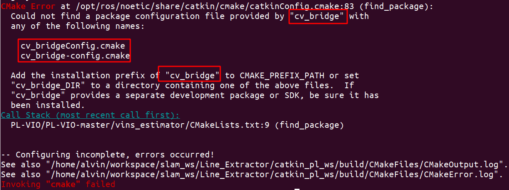
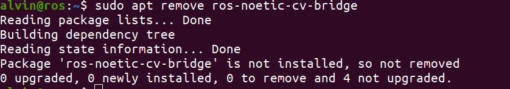
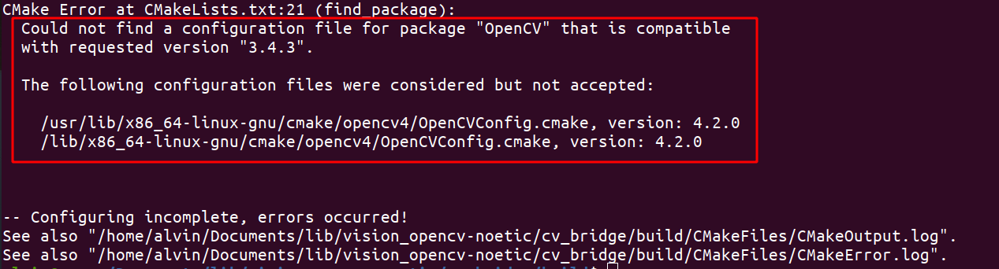
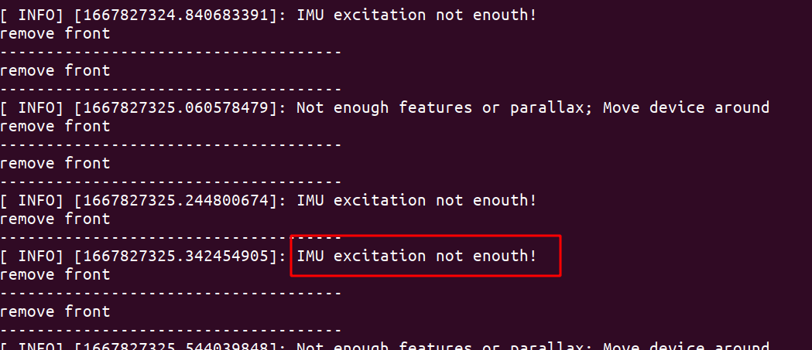

2022.11.7

- 尝试运行 [PL-SLAM](https://github.com/rubengooj/pl-slam) ，运行失败
- 尝试运行 [PL-VIO](https://github.com/HeYijia/PL-VIO) 

使用ros-noetic，/home/alvin/workspaczhongze/slam_ws/Line_Extractor 下创建工作空间 catkin_pl_ws

```bash
mkdir -p catkin_pl_ws/src
cd /catkin_pl_ws/src
git clone https://github.com/HeYijia/PL-VIO.git
cd ../
catkin_make
source ~/catkin_ws/devel/setup.bash
```

catkin_make 出现错误：



通过错误分析，大概率是cv_bridge的问题。

[思路](https://answers.ros.org/question/27211/could-not-find-a-package-configuration-file-provided-by-cv_bridge/)：猜测是cv_bridge 丢失的问题，验证：

```bash
alvin@ros:~$ rospack find cv_bridge
[rospack] Error: package 'cv_bridge' not found
alvin@ros:~$ dpkg -l | grep cv-bridge
ii  ros-foxy-cv-bridge                              2.2.1-1focal.20220209.150123        amd64        This contains CvBridge, which converts between ROS2 Image messages and OpenCV images.
```

解决方案：重新安装 cv_bridge

第一步卸载原来的cv_bridge



下载编译参考：https://lukeyalvin.site/archives/54.html编译的时候报错：



全盘搜索 opencv4

```bash
sudo find / -iname "*opencv*" > /home/alvin/Desktop/opencv_find.txt
```

将之前安装残留的opencv4进行了删除，还是不行，结果直接说查询不到我的OpenCV，我直接对/home/alvin/Documents/lib/vision_opencv-noetic/cv_bridge/CMakeLists.txt做了如下更改，直接告诉它我OpenCV的位置

```cmake
## set(_opencv_version 3.4.3)
## find_package(OpenCV 3.4.3 REQUIRED)
set(OpenCV_DIR /home/alvin/Documents/lib/opencv_3.4.3/opencv_build)
find_package(OpenCV REQUIRED)
##if(NOT OpenCV_FOUND)
##  message(STATUS "Did not find OpenCV 4, trying OpenCV 3")
##  set(_opencv_version 3)
##endif()
```

结果编译成功！

做到这儿，回头看，发现并不是cv_bridge的问题，而是和这个问题一样，就是找不到OpenCV，我就在各个报错的文件夹下的 CMakeLists.txt 中增加了以下两句内容；

```cmake
set(cv_bridge_DIR /usr/local/share/cv_bridge/cmake)
set(OpenCV_DIR /home/alvin/Documents/lib/opencv_3.4.3/opencv_build)
```

终于成功了.......

**总结：主要是因为之前使用 opencv_contribute 来解决 SIFT SUFT由于专利问题无法使用的问题，因此，代码都需要加入上面两行来寻找 OpenCV和cv_birdge**



