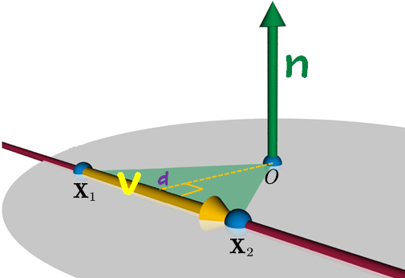
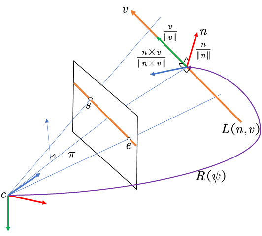

# 齐次坐标

什么是齐次坐标？

欧式空间下的笛卡尔坐标可以很好的用来描述二维/三维的空间几何并解决相关数学运算问题，但在计算机视觉领域下的投影空间中存在着许多无法解释和处理的问题，如：两条平行线在投影空间中的相交问题（这也是结构线SLAM中对Vanish Point 灭点/消影点的提取和利用的前提）

如图所示，现实世界中相互平行的铁轨，竟然在投影空间中可以相交于无限远处的地平线。在欧氏空间中，我们无法描述这样一个存在于无穷远的点，无穷的坐标并不是我们想要在参数化和优化过程中想要看到的。因此，由 `August Ferdinand Möbius` 提出的齐次坐标，就是用来解决这样一类问题的，它使图形和几何学的计算在投影空间中成为可能。

简而言之，齐次坐标就是用 N+1维来代表 N 维坐标。我们可以在一个$2D$ 笛卡尔坐标末尾加上一个额外的变量 $ w$ 来形成 $2D$ 齐次坐标，因此，一个点 $(X,Y)$ 在齐次坐标里面变成了 $(x,y,w)$，并且有：$X=x/w,Y=y/w$

例如，笛卡尔 $(1, 2)$ 中的一个点在 Homogeneous 中变为 $(1, 2, 1)$。如果一个点 $(1, 2)$ 向无穷大移动，则它在笛卡尔坐标中变为 $(∞,∞)$。由于 $(1/0, 2/0) ≈ (∞,∞)$，它在齐次坐标中变为 $(1, 2, 0)$。请注意，我们可以在不使用“$∞$”的情况下表示无穷远点。

为什么叫“齐次”？ 如前所述，为了将齐次坐标 $(x, y, w)$ 转换为笛卡尔坐标，我们只需将 $x$ 和 $y$ 除以 $w$，将齐次转换为笛卡尔，我们可以发现一个重要的事实。让我们看看下面的例子；

如您所见，点 $(1, 2, 3), (2, 4, 6) $ 和 $(4, 8, 12)$ 对应于同一个欧几里得点 $(1/3, 2/3)$。并且任何标量积 $(1a, 2a, 3a)$ 与欧几里得空间中的 $(1/3, 2/3)$ 点相同。因此，这些点是“齐次的”，因为它们代表欧几里得空间（或笛卡尔空间）中的同一个点。换句话说，齐次坐标是尺度不变的。

证明平行线会相交：

对于两条平行线，求其会不会相交，就是联立求方程的解，
$$
\left\{ \begin{array}{l}
Ax+By+C=0	\\
Ax+By+D=0	\\
\end{array} \right.
$$
考虑欧几里得空间中的以下线性系统； 我们知道，由于 $C ≠ D$，上述方程没有解。 如果 $C = D$，则两条线相同（重叠）。让我们通过将 $x$ 和 $y$ 分别替换为 $x/w$、$y/w$ 来重写射影空间的方程。
$$
\left\{ \begin{array}{l}
A\frac{x}{w}+B\frac{y}{w}+C=0	\\
A\frac{x}{w}+B\frac{y}{w}+D=0	\\
\end{array} \right.\Rightarrow 
\left\{ \begin{array}{l}
Ax+By+Cw=0	\\
Ax+By+Dw=0	\\
\end{array} \right.
$$
现在，我们有一个解 $(x, y, 0)$，因为 $(C - D)w = 0, ∴ w = 0$。因此，两条平行线在 $(x, y, 0)$ 相交，即无穷远点。

齐次坐标的使用能够大大简化在三维空间中的点线面表达方式和旋转平移等操作。

## 点在线面的表示

在 $2D$ 平面上，一条直线 $l$  可以用方程 $ax + by + c = 0$ 来表示，该直线用向量表示的话一般记做：
$$
l=(a,b,c)^T
$$
我们知道点 $p = (x, y)$ 在直线 $l$ 上的充分必要条件是 $ax + by + c = 0$.

如果使用齐次坐标的话，点 $p$ 的齐次坐标就是:
$$
ax + by + c = (a,b,c)^T(x,y,1)= l^T\cdot p'=0
$$
因此，点 $p$ 在直线 $l$ 上的充分必要条件就是 直线 $l$ 与 $p$ 的齐次坐标 $p'$ 的内积：$l^T\cdot p'=0$

同理，我们知道 三维空间的一个平面 $A$ 可以用方程 $ax + by + cz + d = 0$ 来表示，三维空间的一个点 $P=(x, y, z) $的齐次坐标 $P'=(x, y, z, 1)$，类似的，点 $P$ 在空间平面 $A$上可以用两个向量的内积来表示，如下：
$$
ax + by + cz + d =(a,b,c,d)^T(x,y,z,1)=A^T\cdot P'= 0
$$
因此，点 $P$ 在平面 $A$ 上的充分必要条件就是平面 $A$ 向量与 $P$ 的齐次坐标 $P'$ 的内积（点乘）：$A^T\cdot P'= 0$

## 线面相交的表示

**结论：在齐次坐标下，可以用两个点 $p, q$ 的齐次坐标叉乘结果来表达一条直线 $l$ ，也可以使用两条直线 $l, m$  的叉乘表示他们的交点 $x$**

证明：

设两个点的坐标为 $p(x_1,y_1),q(x_2,y_2)$，则两点在一条直线 $Ax+By+C=0$ (也可以记为 $(A,B,C)$ )上的条件为
$$
\left\{ \begin{array}{l}
Ax_1+By_1+C=0\\
Ax_2+By_2+C=0\\
\end{array} \right.\Rightarrow
\left\{ \begin{array}{l}
A=-\frac{y_2-y_1}{x_2-x_1}\\B=1\\C=y_1-\frac{y_2-y_1}{x_2-x_1}*x_1
\end{array} \right.\Rightarrow
\left\{ \begin{array}{l}
A=y_1-y_2\\B=x_2-x_1\\C=x_1y_2-y_1x_2
\end{array} \right.
$$
由于齐次坐标 $p(x_1,y_1,1),q(x_2,y_2,1)$，可得 
$$
p\times q =(y_1-y_2,x_2-x_1,x_1y_2-y_1x_2)=(A,B,C)=l
$$
证毕！

证明：利用 $l\times m $ 得到的是同时垂直于 $l,m $ 的直线，且垂直线段之间的点乘为 $0$.
$$
\begin{align*}
l^T&*(l\times m ) = l^T* p'=0\\
m^T&*(l\times m ) = m^T* p'=0
\end{align*}
\Rightarrow p'=l\times m
$$
证毕！

## 齐次坐标区分点和向量

如何在普通坐标(Ordinary Coordinate)和齐次坐标(Homogeneous Coordinate)之间进行转换：

(1)从普通坐标转换成齐次坐标时

   如果 $(x,y,z)$ 是个点，则变为 $(x,y,z,1)$ ;

   如果 $(x,y,z)$ 是个向量，则变为 $(x,y,z,0)$

(2)从齐次坐标转换成普通坐标时   

   如果是 $(x,y,z,1)$，则知道它是个点，变成 $(x,y,z)$ ;

   如果是 $(x,y,z,0)$，则知道它是个向量，仍然变成 $(x,y,z)$ 

# 空间直线的表示方式

因为传统的空间直线的表示方式为两个平面相交：
$$
\left\{ \begin{array}{l}
a_1x+b_1y+C_1z=0\\
a_2x+b_2y+C_2z=0\\
\end{array} \right.\Rightarrow
\begin{bmatrix}
a_1&b_1&c_1&1\\a_2&b_2&c_2&1
\end{bmatrix}
\begin{bmatrix}
x\\y\\z\\1\\
\end{bmatrix}=0
$$
直线上任意两个点可以构成直线方程约束一条直线。将直线方程看成是两个空间点的齐次坐标，这两空间点的齐次坐标作为 $\mathrm{w}$ 的行向量构成 $2×4$ 矩阵：
$$
\mathrm{w}=\begin{bmatrix}
\mathrm{x_1^T}\\\mathrm{x_2^T}
\end{bmatrix}=\begin{bmatrix}
a_1&b_1&c_1&1\\a_2&b_2&c_2&1
\end{bmatrix}
$$
然而这是一种过参数表示，用 $8$ 个参数表示 $4$ 自由度的直线。，在优化问题中会引入额外的约束，在表达点线、线面相交以及相机投影时不太便利。通常引入其他两种空间直线的表示：普吕克坐标以及直线的正交化表示。

## 空间直线的自由度

一条直线的空间自由度为 $4$，它既可以看作是两个空间点的连接(join)，也可以看作是两个空间平面的相交(intersection)，可以从不同角度去理解这个空间自由度为 $4$:

**直线自身角度：**绕直线自身旋转 [旋转三个自由度$(r,p,y)$] 和沿直线方向移动 [平移三个自由度 $(x,y,z)$ ] ，直线不变，因此自由度为 $6 - 2 = 4$。
**平面相交角度：**两个空间平面的自由度为 $3 \times 2 = 6$，两个平面以直线为轴旋转，直线不变，因此自由度为 $(3-1) \times  2 = 4$。
**两点连接角度：**将直线看作是穿过两个正交平面的交点所连接起来的几何体，则两个交点在各自平面上只有 $2$ 个自由度，因此直线自由度为 $2 \times 2 = 4$，如图

## 普吕克坐标

普吕克坐标是一种比较简单的对一条直线进行唯一确定的坐标表示方法，也是一种可以表示所有直线的完备表示方法，许多其他直线的表示方法也可以和普吕克坐标进行互换。

普吕克坐标最直观的理解就是用直线上**两点的向量差（线的方向向量）**和 **两点的向量叉乘（极平面的法向量）** 这六个参数来表示一条直线；

考虑直线  $L$ 上两个不同的点，齐次坐标为： $\mathbf{X}_{1}=\left(x_{1}, y_{1}, z_{1}, w_{1}\right)^{T}$ 和 $\mathbf{X}_{2}=\left(x_{2}, y_{2}, z_{2}, w_{2}\right)^{T}$。

如图所示，普吕克坐标由两空间点确定，其齐次坐标分别为 $\mathbf{X}_{1}=\left(x_{1}, y_{1}, z_{1}, w_{1}\right)^{T}$ 和 $\mathbf{X}_{2}=\left(x_{2}, y_{2}, z_{2}, w_{2}\right)^{T}$。其中：$\vec{v}=\mathbf{X}_{2}-\mathbf{X}_{1}$；矩：$\vec{n}=\mathbf{X}_{2}\times\mathbf{X}_{1}$（矩指的是质点从 $\mathbf{X}_{1}$ 移动到 $\mathbf{X}_{2}$ 的矩，$n$ 的大小为三角形 $O\mathbf{X}_{1}\mathbf{X}_{2}$ 面积的两倍，正比于 $v$ 的大小）

**这个齐次坐标里面的 $w$ 表示直线 $3$ 维坐标的模**，也就是
$$
w=\sqrt{x^2+y^2+z^2}
$$
定义普吕克矩阵如下：
$$
\begin{align*}
\mathbf{L}=\mathbf{X}_{2} \mathbf{X}_{1}^{\mathrm{T}}-\mathbf{X}_{1} \mathbf{X}_{2}^{\mathrm{T}} \in \mathbb{R}^{4 \times 4} &= \begin{bmatrix}
0 & x_2y_1-x_1y_2 &x_2z_1-x_1z_2  & x_2w_1-x_1w_2\\
-x_2y_1+x_1y_2 &0  &y_2z_1-y_1z_2  &y_2w_1-y_1w_2 \\ 
-x_2z_1+x_1z_2 & -y_2z_1+y_1z_2 &0  & z_2w_1-z_1w_2\\ 
-x_2w_1+x_1w_2 &-y_2w_1+y_1w_2  & -z_2w_1+z_1w_2 &0 
\end{bmatrix}\\
&=\begin{bmatrix}
0&n_3&n_2&v_1\\
-n_3&0&n_1&v_2\\
-n_2&-n_1&0&v_3\\
-v_1&-v_2&-v_3&0
\end{bmatrix}\\
&=\begin{bmatrix}
[\mathbf{n}]_{\times}&\mathbf{v}\\
-\mathbf{v}^T&0
\end{bmatrix}
\end{align*}
$$
代入计算，发现普吕克矩阵有特殊性质:

只有 $\vec{v}$ 和 $\vec{n}$ 同时确定才能唯一确定一条直线 $L$，定义齐次坐标如下：
$$
(v:n)=(v_1:v_2:v_3:n_1:n_2:n_3)
$$
其中：
$$
\begin{align*}
\left\{ \begin{array}{l}
v_1&=x_2w_1-x_1w_2\\
v_2&=y_2w_1-y_1w_2\\
v_3&=z_2w_1-z_1w_2\\
n_1&=y_2z_1-y_1z_2\\
n_2&=x_2z_1-x_1z_2\\
n_3&=x_2y_1-x_1y_2\\
\end{array} \right.
\end{align*}
$$
可以发现，所有的 $(\lambda v:\lambda n),\lambda \ne 0$ 都可以由直线 $L$ 上不同的两个点生成，我们称 $(v:n)$为直线的普吕克坐标。

- **普吕克矩阵是反对称矩阵，且对角元素均为 $0$，只有 $6$ 个有效非零元素 ($6$ DOF)**

- $\operatorname{det}(\mathbf{L})=0$ **(减去 $1$ DOF)**

- **取同一空间直线上任意两对空间点，它们对应的普吕克坐标只相差一个系数** $\mathbf{L}=\alpha \mathbf{L}^{\prime}$ **(减去 $1$ DOF)，所以普吕克矩阵实际自由度为 $4$。**

**普吕克坐标即由普吕克矩阵中 $6$ 个非零的元素，将其按照一定的顺序排列成的一个六维向量，**这里采用Bartoli论文中记号：
$$
\mathcal{L}=\left[
\begin{array}{c}{\widetilde{\mathbf{X}}_{1} \times \widetilde{\mathbf{X}}_{2}} \\ {w_{1} \widetilde{\mathbf{X}}_{2}-w_{2} \widetilde{\mathbf{X}}_{1}}\end{array}
\right]=\left[\begin{array}{l}{\mathbf{n}} \\ {\mathbf{v}}\end{array}\right] \in \mathbb{P}^{5} \subset \mathbb{R}^{6}
$$
几何意义理解：

- $\mathcal{L}$ 中的元素由 $\mathbf{L}$ 中的非零元素对应，其中 $\mathbf{v}$ 是直线的方向向量。
- 矩 $\mathbf{n}$ 是过该直线且通过原点的平面的法向量，并且垂直于 $\mathbf{v}$ ，即 $\mathbf{n}^{\mathrm{T}} \mathbf{v}=0$.
- 原点到空间直线的垂直距离 $\|\mathbf{n}\| /\|\mathbf{v}\|$，垂足  $\mathbf{d}$ 的齐次坐标为 $\left(\mathbf{v} \times \mathbf{n}, \mathbf{v}^{\mathrm{T}} \mathbf{v}\right)$

## 直线的普吕克表示

三个非共线点，包括一条线段的两个端点和坐标原点相机中心 $c_i = (c_{ix}，c_{iy}，c_{iz})^T$ ，在三维空间中确定一个平面 $\pi_i=[\pi_{ix},\pi_{iy},\pi_{iz},\pi_{iw}]^T$:
$$
\pi_{ix}(x-c_{ix})+\pi_{iy}(y-c_{iy})+\pi_{iy}(z-c_{iy})=0
$$
其中 $\pi_i$ 是滑动窗口中的第 $i$ 个平面向量。 $\pi_i$中的  $(\pi_{ix}，\pi_{iy},\pi_{iz})$ 可以使用 $s_i$ 和 $e_i$ 的叉积计算得到，$s_i$ 和 $e_i$ 是检测到的线段的两个端点；$\pi_{iw}$ 可以使用相机中心 $c_i = (c_{ix}，c_{iy}，c_{iz})$ 计算得到；
$$
\begin{bmatrix}\pi_{ix}\\\pi_{iy}\\\pi_{iz}\end{bmatrix}=[\mathbf{s}^{c_i}]_\times\mathbf{e}^{c_i},\quad 
\pi_{iw}=\pi_{ix}c_{ix}+\pi_{iy}c_{iy}+\pi_{iz}c_{iz}
$$

由两个相机坐标系 $c_0$ 和 $c_1$ 创建的两个平面 $\pi_1$ 和 $\pi_2$ 在一条3D线上相交，这成为3D线特征。对偶 Plücker 矩阵 $\mathbf{L}^*$ 可以通过下式计算:
$$
\mathbf{L}^*=\begin{bmatrix}[v]_{\times}&n\\ -n^T&0\end{bmatrix}=\pi_1\pi_2^T-\pi_2\pi_1^T\in\mathbb{R}^{4\times 4}
$$
相机帧 $c_1$ 中的普吕克坐标 $\mathbf{L}$ 很容易从双普吕克矩阵   $\mathbf{L}^*$ 中提取。可以看出，$n$ 和 $v$ 不需要是单位向量。

## 直线参数化的正交表示

**对于普朗克矩阵，使用的 $6$ 参数的形式大于空间直线的 $4$ 个自由度，且存在正交约束，因此普吕克坐标是一种过参数化的表示。因此Bartoli提出了一种 $4$ 参数的最小化表示方法，称之为正交表示。**
$$
\mathcal{O}=[\psi_1 ,\psi_2 ,\psi_3, \phi ]
$$

将 $\mathbf{n,v}$ 组成如下增广矩阵 $\mathbf{[n|v]}$，然后进行 $QR$ 矩阵分解，由于存在正交约束 $\mathbf{n}^T\mathbf{v} =0$，因此其分解的结果比较特殊：
$$
\begin{align*}
\mathcal{L}=[\mathbf{n} | \mathbf{v}]
&=\left[\frac{\mathbf{n}}{\|\mathbf{n}\|} \quad \frac{\mathbf{v}}{\|\mathbf{v}\|} \quad \frac{\mathbf{n} \times \mathbf{v}}{\|\mathbf{n} \times \mathbf{v}\|}\right]\left[\begin{array}{cc}{\|\mathbf{n}\|} & {0} \\ {0} & {\|\mathbf{v}\|} \\ {0} & {0}\end{array}\right]\\
&=[{\mathbf{u_1} }\quad{\mathbf{u_2} }\quad{\mathbf{u_3} }]\left[\begin{array}{cc}{w_1} & {0} \\ {0} & {w_2} \\ {0} & {0}\end{array}\right]\\
&=\mathbf{U_{3\times3} }\mathbf{W_{3\times2} }\in\mathrm{SO(3)}\times\mathrm{SO(2)}
\end{align*}
$$
分解得到的第一项是正交矩阵 $\mathbf{U}$ ，是一个旋转矩阵。所表示的是相机坐标系到直线坐标系的旋转。直线坐标系的三个轴方向分别顺序对应这三项。
$$
\mathbf{U}=\mathbf{R}(\psi_x,\psi_y,\psi_z)=\left[\frac{\mathbf{n}}{\|\mathbf{n}\|} \quad \frac{\mathbf{v}}{\|\mathbf{v}\|} \quad \frac{\mathbf{n} \times \mathbf{v}}{\|\mathbf{n} \times \mathbf{v}\|}\right]\in\mathrm{SO(3)}
$$
对于第二项，由于 $d=\frac{\|\mathbf{n}\|}{\|\mathbf{v}\|}$ 为直线到原点的距离，只有一个自由度，所以可以用三角函数矩阵参数化：

$$
\mathbf{W}=

\left[\begin{array}{cc}{\cos (\phi)} & {-\sin (\phi)} \\ {\sin (\phi)} & {\cos (\phi)}\end{array}\right]
=\left[\begin{array}{cc}{w_{1}} & {-w_{2}} \\ {w_{2}} & {w_{1}}\end{array}\right]
=\frac{1}{\sqrt{(\|n\|^2+\|v\|^2)} }\left[\begin{array}{cc}{\|n\|} & {-\|v\|} \\ {\|v\|} & {\|n\|}\end{array}\right]\in\mathrm{SO(2)}
$$
 其中 $w_{1}, w_{2}>0$，对应的 $\phi\in\left(0, \frac{\pi}{2}\right]$

**因此四个自由度分别是 $\psi_x,\psi_y,\psi_z$ ：分别代表直线坐标轴围绕 $xyz$ 轴旋转的角度，以及参数 $\phi$ ：隐含了坐标原点到直线的距离。**

正交表示 $\mathcal{L}'$ 到Plücker坐标 $\mathcal{L}$ 之间的变换方式为：
$$
\mathcal{L} = \begin{bmatrix}w_1\mathbf{u_1}\\w_2\mathbf{u_2}\end{bmatrix}=\frac{1}{\sqrt{(\|n\|^2+\|v\|^2)} }\mathcal{L}'
$$
其中 $u_i$ 代表的是 $\mathbf{U}$ 矩阵的第 $i$ 列。虽然 $\mathcal{L}$ 和 $\mathcal{L}'$ 有一个尺度的差，但是它们表示的是同一条空间直线；

## 空间直线的观测模型

线特征从归一化平面到像素平面的投影内参矩阵 $\mathcal{K_l}$ 点特征内参矩阵为 $\mathcal{K_p}$ 。已知存在空间直线 $\mathcal{L}^c$ ，点 $C$ 和 $D$ 是直线 $\mathcal{L}^c$ 上两点，点 $c$ 和 $d$ 是它们在像素平面上的投影，$\pmb{l}$ 是对应空间直线在像素平面的投影。即存在关系：
$$
c=\mathcal{K_p}C,\quad d=\mathcal{K_p}D,\quad \mathcal{L}^c=C\times D,\quad \pmb{l}=c\times d
$$

$$
\pmb{l}=\left[\begin{array}{l}{l_{1}} \\ {l_{2}} \\ {l_{3}}\end{array}\right]=\mathcal{K_l} \mathcal{L}^c=\left[\begin{array}{ccc}{f_{y}} & {0} & {0} \\ {0} & {f_{x}} & {0} \\ {-f_{y} c_{x}} & {-f_{x} c_{y}} & {f_{x} f_{y}}\end{array}\right] \mathbf{n}^{c}
$$

上式表明，**直线的线投影只和法向量 $\mathbf{n}^{c}$ 有关**，和方向向量 $\mathbf{v}^{c}$ 无关。其中，$\mathbf{n}^{c}$ 为相机坐标系下的直线 $\mathcal{L}^c$ 的法向量，它是有世界坐标系下的直线变换得到的：
$$
\mathcal{L}^c=\left[\begin{array}{c}{\mathbf{n}^{c}} \\ {\mathbf{v}^{c}}\end{array}\right]
=\mathcal{T}_{cw}\mathcal{L}^w=
\left[\begin{array}{cc}{\mathbf{R}_{c w}} & {\left[\mathbf{t}_{c w}\right]_{ \times} \mathbf{R}_{c w}} \\ {\mathbf{0}} & {\mathbf{R}_{c w}}\end{array}\right]\left[\begin{array}{l}{\mathbf{n}^{w} } \\ {\mathbf{v}^{w} }\end{array}\right]
$$

其中 $[\cdot]_{ \times}$ 是三维向量的斜对称矩阵，$\mathcal{T}_{cw}$ 是用于将线从$w$ 坐标系变换到 $c$ 坐标系的变换矩阵。

## 空间直线的误差模型

状态向量：
$$
\mathcal{X}=[\mathbf{x_1},\mathbf{x_2},···,\mathbf{x_{k-1} },\lambda_1,\lambda_1,···,\lambda_{m-1},\mathcal{O}_1,\mathcal{O}_2,···\mathcal{O}_{n-1}]
$$
其中，$\mathbf{x_i}=[p^w_{b_i},q^w_{b_i},v^w_{b_i},b_a,b_g]$，$\mathcal{O}_j=[\psi_j,\phi_i]$；

$\mathcal{X}$ 是整个状态，$\mathbf{x_i}$ 是第 $i$ 个滑动窗口中的状态，并且由加速度计和陀螺仪的位置，四元数，速度和偏置(按出现的顺序组成)。此外，整个状态包括表示为 $\lambda$ 的点特征的逆深度。此外，还包括新添加的线 $\mathcal{O}_j$ 的正交表示。

在下图 $c_3$ 的情况下，投影的3D线特征不具有终点。因此，通过查找检测到的2D线特征端点与3D线特征之间的距离来计算成本函数或残差，如下所示:

$$
\mathbf{r}_\mathcal{L}(\mathbf{z}^c_l,\mathcal{X})=\begin{bmatrix}d(s^c,\pmb{l}^c)\\d(e^c,\pmb{l}^c)\end{bmatrix},\quad d(p,\pmb{l})=\frac{p^T\pmb{l} }{\sqrt{l_1^2+l_2^2} }
$$
其中 $r_\mathcal{L}$ 是线特征的残差，$\mathbf{z}^c_l $ 是检测到的线 $\pmb{l}$ 相对于相机坐标 $c$ 的测量值。 $r_\mathcal{L}$ 由 $\pmb{l}$ 和和端点 $p$ ( $s^c$ 或 $e^c$ ) 之间的距离组成。

通过最小化线重投影误差 $\mathbf{r}_\mathcal{L}(\mathbf{z}^c_l,\mathcal{X})$ 来优化第 $i$ 个状态和第 $l$ 条线参数。对应的雅可比矩阵可以通过链式法则得到：

$$
\mathbf{J}_l=\frac{\partial \mathbf{r}_{\pmb{l} } }{\partial \pmb{l}^{c_i} }
\frac{\partial \pmb{l}^{c_i} }{\partial \mathcal{L}^{c_i} }
[\frac{\partial \mathcal{L}^{c_i} }{{\partial \delta \mathbf{x}_i } }
\quad \frac{\partial \mathcal{L}^{c_i} }{{\partial \mathcal{L}^{w} } }
\frac{\partial \mathcal{L}^{w} }{{\partial \delta\mathcal{O}^{w} } }]
$$
总体优化函数：
$$
\begin{align*}
\underset{\mathcal{X} }{\min}
\left\{ \begin{array}{l}
\underbrace
{\parallel \mathbf{r}_p-\mathbf{H}_p\mathcal{X} \parallel^2}_{边缘化的先验信息}
+\underbrace
{\underset{k\in\mathcal{B} }{\sum}\parallel\mathbf{r}_{\mathcal{B} }(\hat{\mathbf{z} }^{b_k}_{b_{k+1} },\mathcal{X})  \parallel^2_{\mathbf{P}^{b_k}_{b_{k+1} } } }_{IMU 测量残差}
+\underbrace
{\underset{(i,j)\in\mathcal{P} }{\sum}\parallel\mathbf{r}_\mathcal{P}(\hat{\mathbf{z} }^{c_j}_{p_i},\mathcal{X}) \parallel^2_{\mathbf{P}^{c_j}_{p_i} } }_{点特征的重投影残差}
\end{array} \right. \\
\left. \begin{array}{r}
+\underbrace
{\underset{(i,j)\in\mathcal{L} }{\sum}\parallel\mathbf{r}_\mathcal{L}(\hat{\mathbf{z} }^{c_j}_{l_i},\mathcal{X}) \parallel^2_{\mathbf{P}^{c_j}_{l_i} } }_{线特征的重投影残
差}
+\underbrace
{\underset{i\in\mathcal{L^*} }{\sum}\underset{j\in\mathcal{L^*} }{\sum}\parallel\mathbf{r}_\mathcal{S}(\hat{\mathbf{z} }_{ij},\mathcal{X}) \parallel^2 }_{结构约束}
\end{array} \right\} 

\end{align*}
$$

当给定 $t$ 处的当前帧时，**1）使用 LSD 提取线特征。**在此过程中，为了鲁棒性，删除了短线特征。 **2）提取的线特征与第（$t-1$）帧的前线特征匹配。**但是，从初步匹配结果中可以看出，分割线或断线不匹配，即使它们应该被视为相同的线。为了解决这个问题，我们增加了一个步骤：**3）基于光流的线预测。**在这一步中，通过光流传输在 $t-1$ 观察到的线端点来预测 $t$ 处的新线特征。并通过与 $t$ 处的线特征匹配来检查从 $t-1$ 预测的线特征是否是错误识别的线。**4）使用这些预测的线特征来补充初步的匹配结果。**在初步匹配结果中的线特征中，存在应该匹配但是没有匹配的线。在匹配线的情况下，比较从光流提取的线与其相应线之间的匹配分数，并选择得分较高的线特征作为最终线特征。当线不匹配时，提取的线特征将替换为来自光流的相应线特征。因此，可以利用更稳健的线特征，并且可以更稳健地连续跟踪线特征。

## 退化约束的构建

通常，退化可以通过计算到极点的距离来确定。要确定退化，必须在三角测量过程中计算出极点的位置。表示极点位置的方程式如下:
$$
p_{epipole} = \mathbf{R}^w_{c_j}(t^w_{c_i}-t^w_{c_j})
$$
其中 $p_{epipole}$ 是第 $i$ 个相机坐标 $c_i$ 相对于第 $j$ 个相机坐标 $c_j$ 的表极。 $p_{epipole}$ 由旋转矩阵 $\mathbf{R}^w_{c_j}$ 和相机相对于世界坐标的平移 $t^w_c$ 计算。可以看出极点的位置受相机运动的影响。

特别是在纯旋转中，线特征的退化条件更容易接受。如果相机以纯平移的方式移动，则极点位于相机移动方向的无穷大处。在这种情况下，当2D线被认为是直线而不是线段时，所有与相机运动平行的线都可以被认为穿过了极点。例如，在图2 (a) 和 (b) 中，相机的移动分别在 $x$ 和 $y$ 方向上。在本文中，当相机以纯平移方式移动时，即发生退化时，确定与相机运动平行的线特征。

> 图2.在 EuRoC 数据集 [26] 中提取了在相机的纯平移中发生退化的图像线条。红线是提取的线，绿线是连接提取线的极点和中点的线。(a) 摄像机沿 $x$ 轴移动，并且在沿 $x$ 轴方向的所有行中都发生退化。(b) 相机沿$y$ 轴移动，并且在沿 $y$ 轴方向的所有行中发生退化。

### 使用结构约束避免退化

图1.退化的说明。当线靠近极点时，会发生退化。在三角测量过程中，由每个摄像机中心和观察到的线特征形成的 $\pi_0$ 和 $\pi_1$与对极面重合。然后，估计的3D线应该在蓝色的平面上。尽管实际的3D线是红色实线，但三角测量会错误地将估计的线确定为平面上无限多条虚线之一。

当线特征发生退化时，在建图过程中会获得错误的方向矢量。通过线三角化过程 ，得到线的方向向量 $d$ 如下:
$$
d=\begin{bmatrix}
\pi_{0z}\pi_{1y}-\pi_{0y}\pi_{1z}\\
\pi_{0x}\pi_{1z}-\pi_{0z}\pi_{1x}\\
\pi_{0y}\pi_{1x}-\pi_{0x}\pi_{1y}
\end{bmatrix}
$$
当极点接近线特征时，两个平面矢量 $\pi_0(\pi_{0x}，\pi_{0y}，\pi_{0z})$ 和 $\pi_1(\pi_{1x}，\pi_{1y}，\pi_{1z})$ 是平行的，如图1所示，因此，理论上，以 (7) 中 $d$ 的每个元素为 $0$， $d$ 成为零矩阵。但是，由于可能存在该线特征的测量噪声，因此可能会计算出错误的方向矢量。因此，当以这种方式发生退化时，普吕克坐标的方向矢量会受到影响和异常。最后，由于退化线，获得了较差的建图结果。

然而，主要用于优化过程的中线的重投影误差不能解决退化问题。因为线的重投影误差只使用了法向量，它不能修正方向向量的误差。现有算法通过去除退化线来解决退化问题。然而，这种方法会导致有价值的线特征信息的丢失。因此，需要在不去除退化线特征的情况下对线方向向量进行校正。

> 图3.显示消失点和极点在沿 $x$ 轴的纯平移中相同的插图。虚线指示的对象是表示为其运动的相机的平移。由于穿过对象的同一点的直线是平行的，因此它们在3D中具有无穷大的共同消失点。此外，由于它是纯旋转，因此在3D中，极点位于无限远处。因此，当投影到2D图像上时，消失点和表极点是相同的。

通过退化分析，发现退化通常发生在纯平移的相机运动中。此外，我们考虑了在纯平移相机运动中，如在图3中所示的那样，该极点和消失点具有相同的位置，因此，退化线总是在基线方向上具有消失点。因此，对于具有退化的线，可以使用它们在3D中平行的特性来校正具有相同消失点的线。我们将其定义为结构约束，平行条件的残差为:
$$
\mathbf{r}_{\mathcal{S} }(\mathbf{z}_{ij},\mathcal{X})=\mathbf{d}_i\times\mathbf{d}_j
$$
其中 $\mathbf{d}_i$ 和 $\mathbf{d}_j$ 分别表示第 $i$ 条和第 $j$ 条线的方向向量。因此，因为通过将所有发生退化的线配对来创建约束，所以可以通过创建平行线来提高映射的准确性。与其他方法 [29]、[30] 相比，例如使用 J-linkage [31]、[32] 寻找到消失点的平行线，这种方法更有效
