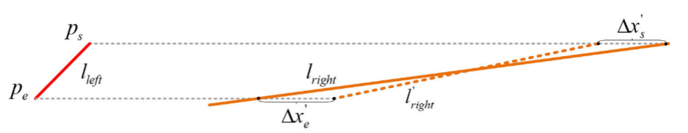
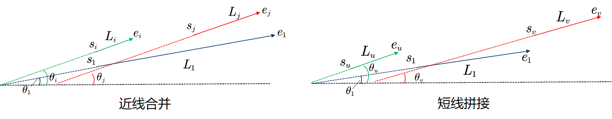

立体框架中的空间线可以通过左图像中的两个端点来重建。如图所示，假设左图像中的线段 $l_{left}$ 已经与右图像中的线段 $l_{right}$ 匹配，则线 $l_{right}= (l_a，l_b，l_c)^T$  可以从其两个端点的正交坐标获得。

在校正后的立体帧中，左图像中的一个点，与其在右图像中对应的点共享相同的 $y$ 坐标，结果，可以通过将 $l_{right}$ 与线 $l_{y = y^{\prime} } $ 相交来获得右图中的相应点，其中 $y^{\prime}$ 是左点的 $y$ 坐标。

在 $l_{left}$ 的两个端点分别表示为 $p_s=(x_s,y_s)^T,p_e =(x_e,y_e)^T$ 的情况下，它们在右图中的对应点的 $x$ 坐标可以获取为
$$
x^{\prime}_s=-\frac{l_by_s+l_c}{l_a}\\
x^{\prime}_e=-\frac{l_by_e+l_c}{l_a}
$$
然后将 $p_s,p_e$ 的差异表示为 $dis\ p_s = x_s − x_s^{\prime}$， $dis\ p_e = x_e − x_e^{\prime}$，$p_s,p_e$ 的深度由
$$
d_s=\frac{bf_x}{dis\ p_s}\\
d_e=\frac{bf_x}{dis\ p_e}\\
$$
其中 $b$ 是立体配置的基线。

在已知 $d_s$ 的情况下，端点 $p_s$ 可以通过下式反投影到其 3-D 点 $P_s$
$$
P_s=\begin{bmatrix}X_s\\Y_s\\Z_s\end{bmatrix}
=\begin{bmatrix}\frac{(x_s-c_x)d_s}{f_x}\\\frac{(y_s-c_y)d_s}{f_y}\\d_s\end{bmatrix}
$$
与3-D点相比，从立体框架重建的空间线稳定性较差，尤其是对于图像中的水平线。对于立体框架中的点特征，它们的差异越大，它们的空间位置误差就越小，而对于线特征则不正确，因为尽管水平线比垂直线更靠近相机，水平线的位置误差通常大于垂直线的位置误差。

这可以由图4a来解释。通常，真实线段 $l_{right}$ 会受到传感器噪声和/或线检测算法误差的干扰，因此其测量 $l_{right}^{\prime}$ 会不同于 $l_{right}$ 。带噪声的 $l_{right}^{\prime}$  会导致 $x_s^{\prime}$ 和 $x_e^{\prime}$ 的错误。

对于接近的水平线，只需要很小的干扰就能带来较大的 $x_s^{\prime}$ 和 $x_e^{\prime}$ 误差。因此，**接近的水平线比接近的垂直线承受更大的位置误差**。如图4b所示，红线的角度小于蓝线的角度，并且它们的位置比图4c和图4d所示的这些蓝线的位置更不准确。为了正确建模从立体框架重建的空间线的不确定性，应考虑立体线的结构特性。

考虑 $p_s$ 关于 $P_s$ 的方程已知，可以导出雅可比 $J_{P_s}$，用协方差的传播方法计算出 $p_s$ 的不确定性矩阵，表示为
$$
\sum_{P_s}=J_{P_s}cov(p_s)J^T_{P_s}
$$
其中 $cov(p_s)$ 是 $p_s$ 的不确定性矩阵，并被建模为二维高斯，在图像平面中具有标准偏差 $\sigma_x = \sigma_y = 1$ 像素。为了使不确定性矩阵更加直观，我们进一步将其转换为 [20] 中的 (17) 以下称为熵的标量。至于另一个端点 $P_e$，其熵 $\sigma_e$ 可以用同样的方法获得。对于从立体框架重建的空间线，如果其 $\sigma_s$ 和  $\sigma_e$ 都足够小，则可以将其视为准确的线。

---

EDLines是一种线段检测器，具有准确的结果和燃烧速度。它旨在用于实时计算机视觉和图像处理应用程序。EDLines包括三个步骤: 首先，在给定的灰度图像上运行边缘绘制 (ED) 算法。其次，通过最小二乘线拟合方法从生成的像素链中提取线段。第三，亥姆霍兹原理用于消除错误的线段检测。EDLines的流程图如图1所示。

如图2所示，与LSD相比，EDLines检测到的线段特征的数量较少，但是提取的线特征的平均长度较大。这主要是由以下三个原因造成的: 第一，EDLines算法对线段长度有一个最小阈值，长度小于阈值的线段不会被提取。其次，EDLines算法包含一个线拟合步骤，该步骤可以将几个短线段拟合成一个长线段。第三，在LSD算法中，如果一个点被一个线段使用，其他线段不能使用这个点，这会导致相交的线段断裂。EDLines检测到的线段由LBD线描述符 [26] 表示，LBD线描述符是描述线段周围的像素信息的256位矢量。

基于LBD描述符，我们引入了线段特征的几何特性，以提高线段特征匹配的性能。两条匹配的线段 l1、l2 应满足以下条件。 (1)两条线段的LBD描述符之间的距离小于某个阈值。 (2) 两条线段中点之间的距离小于给定值d。 (3) 两条线段的角度差小于某个阈值θ。 (4) 两条线段的平均梯度之差小于某个阈值。

---

跟踪线程的第一步是提取新帧的特征。采用的机制是并行提取点特征和线特征。点特征由 ORB 提取和 256 位 ORB 描述符描述。对于线特征，我们提出了SLD（直线段检测器）线段提取算法。 SLD首先对图像进行灰度化，然后使用边缘检测算法对图像进行二值化。在检测到的边缘像素处，将线与其相邻像素连接起来，并继续拟合线并延伸到下一个边缘像素，直到与当前线段共线。

在边缘检测的过程中，我们在[36]的方法中优化了固定阈值，提出了一种自适应的canny阈值边缘检测算法。高低阈值与图像的灰度分布有关。自适应Canny边缘检测阈值的计算如公式 (1) 和公式 (2) 所示。阈值与输入灰度图像的像素灰度值的均值和标准差有关。计算平均值和标准偏差如公式 (3) 所示。

其中λ是比例值，N是图像中的像素数。通过大规模数据集实验发现，自适应canny阈值边缘检测算法在λ=1.2时对大部分图像都能得到很好的边缘检测结果。

基于边缘像素检测，SLD分段提取算法定义了以像素值不为0的边缘像素为种子起点的线链，和相邻像素的8个可能方向。得到线性预测像素链后，判断当前线上的像素是否构成直线。此时，可以通过使用直线预测像素链起点像素和终点像素形成直线段，并且将像素链中靠近直线的点到直线的距离与阈值进行比较，以确定像素点是否属于线段。得到几个线段后，一般会进行线段合并。

但是，我们发现线段组合需要很长时间。一旦控制了生成线段的长度比例，线段组合效果的改善就不明显。因此，该算法放弃了线段增量合并的策略，并限制了提取的线段的数量和长度。通过实验发现，去除像素大小小于图像大小最小5% 的线段可以获得良好的提取效果，且提取速度较经典LSD算法有很大提高。

---

提出了一种改进的LBD描述符来描述本文提取的线段。原始 LBD 描述符只有 72 维，由于原始 LBD 描述符不是二进制的，并且在匹配特征时需要计算特征向量之间的距离，因此计算非常耗时。因此，本文将从 32 组随机选取的 72 维 LBD 描述符中提取两个元素，并以固定顺序重新进行比较，得到由 0 和 1 两个字符组成的 256 位向量。对于每一组，比较方法如图 2 所示，其中 N 是在图像中检测到的片段数。比较每个 72 维线段 LBD 描述符中的 9 个条带中随便选取的两条条带的平均向量 Mj 和标准误差向量 Sj，得到一个 8 维二进制描述符，比较共 32 组，然后形成一个256 维 LBD 描述符。通过上述方式获得的二进制LBD描述符可以通过二进制异或等运算快速计算出两个特征向量之间的汉明距离，从而加速线段匹配的过程。

---

# 线特征的合并策略

## 一些参数的表示

用户定义和自适应阈值和参数。

$\tau_{\theta}$  用户定义的**角度接近度阈值**，用于根据绝对角度差计算等式。

$\xi_s$  用于计算**自适应空间接近阈值** $\tau_s$ 的用户定义**空间接近度**参数。

$\tau_s$  基于绝对轴对齐距离对线段进行分组的**自适应空间接近阈值**。

$\tau_{\theta}^*$ 根据角度差、长度和最近距离合并线段对的**自适应角度接近度阈值**。

之后使用 $\mathcal{D}$ 表示检测到的线段集合，使用 $\mathcal{L}$ 表示合并线段的集合。对于一对线段 $(L_1,L_2)$ ，我们使用 $(l_1,l_2)$ 和 $(\theta_1,\theta_2)$ 分别表示它们的长度和角度。对于任一条线段 $L_i$，我们使用 $(s_{ix},s_{iy})$ 和  $(e_{ix},e_{iy})$ 表示两个端点。

**空间接近：**线段必须在空间上足够接近才能被分组。 

**角度接近:** 线段的方向应该彼此相差不大。

可合并性与较短段的长度、角度差和相对空间距离成反比，并且与较长段的长度成正比。因此，引入了与长度和距离有关的阈值来进行可合并性决策。

由于可合并性与较长段 $L_1$ 的长度 $l_1$ 成正比，因此可以自适应地将空间接近度的阈值设置为：
$$
\tau_s = \xi_sl_1
$$
其中 $0 < \xi_s < 1$ 是用户指定的分数。对于每个线段 $L_1$ ，自适应空间接近阈值 $\tau_s$  确定最近点 $c_1$ 和 $c_2$ 之间距离 $d$ 的最大允许值。例如，$\xi_s=0.1$ 意味着线段 $L_1$ 的空间接近阈值是 $L_1$ 长度的 $10\%$。

为了结合线段的合并性和长度 $l_2$  的较短线段之间的反比关系，我们首先通过其最大允许值 $l_1$ 对 $l_2$ 进行归一化。因此，我们获得归一化长度：
$$
\hat{l}_2 = \frac{l_2}{l_1}
$$
类似地，我们通过其最大允许值 $\tau_s$ 对最近距离 $d$ 进行归一化。这给了我们归一化的距离：
$$
\hat{d}= \frac{d}{\tau_s}
$$
组合的归一化长度和距离约束可以计算为：
$$
\lambda=\hat{l}_2+\hat{d}
$$
当 $l_2$ 和 $d$ 都较小时，可合并性增加，$\lambda$ 减小。最后，该自适应长度和距离约束用于自适应地调整角差阈值 $\tau_{\theta}$ 为：
$$
\tau^*_{\theta}=\left(1-\frac{1}{1+e^{-2(\lambda-1.5)}}\right)\tau_\theta.
$$

## 合并步骤

$Step 1:$  根据传统的空间和角度接近度度量对线段进行分组

首先**按线段长度**对提取出的线段进行**降序排列**，得到 $\{L_1，L_2,…,L_n\}$，其中 $L_n$ 表示第 $n$ 条线段 ;

设当前最长线段为 $L_1$，则剩余线段的集合为：$L = \{L_2,L_3,...L_n\}$；

选择 $L_1$ 角度接近的线段组 $\mathcal{P}_{L_1}$ ：
$$
\mathcal{P}_{L_1} = [\forall L_i\in\mathcal{L}:(|\theta_i - \theta_1|<\tau_{\theta})].\quad i\in[2,n]
$$
使用空间接近度进一步过滤集合  $\mathcal{P}_{L_1}$ ：

- 水平距离：
  - 近线合并
    $$
    \mathcal{P}_{L_1}=\left\{ \forall L_i,L_j\in \mathcal{P}_{L_1}:\left( \left| x_{s_i}-x_{s_m} \right|<\tau_s \right) \lor \left( \left| x_{e_j}-x_{e_m} \right|<\tau_s \right) \right\}
    $$

  - 断线拼接
    $$
    \mathcal{P}_{L_1}=\left\{ \forall L_u,L_v\in L_{\alpha}:\left( \left| x_{e_u}-x_{s_m} \right|<\tau_s \right) \lor \left( \left| x_{s_v}-x_{e_m} \right|<\tau_s\right) \right\}
    $$

  垂直距离

  - 近线合并

  $$
  \mathcal{P}_{L_1}=\left\{ \forall L_i,L_j\in \mathcal{P}_{L_1}:\left( \left| y_{s_i}-y_{s_m} \right|<\tau_s \right) \lor \left( \left| y_{e_j}-y_{e_m} \right|<\tau_s\right) \right\}
  $$

  - 断线拼接

  $$
  \mathcal{P}_{L_1}=\left\{ \forall L_u,L_v\in L_{\alpha}:\left( \left|y_{e_u}-y_{s_m} \right|<\tau_s \right) \lor \left( \left| y_{s_v}-y_{e_m} \right|<\tau_s\right) \right\}
  $$

$Step2:$ 考虑每个组中的成对线段，如果它们满足我们的可合并标准，则将它们合并为单个线段。重复这两个步骤，直到不能再合并线段。

$Step3: $ 合并成功后则需要进一步检验，如果对较长的线段 $L_1$ 和合并的线段 $M$ 的绝对角度差大于 $\frac{\tau_{\theta}}{2}$，将放弃合并。此阈值的额外严格性是为了确保合并的段不会偏离较长的线段 $L_1$ 太远。

