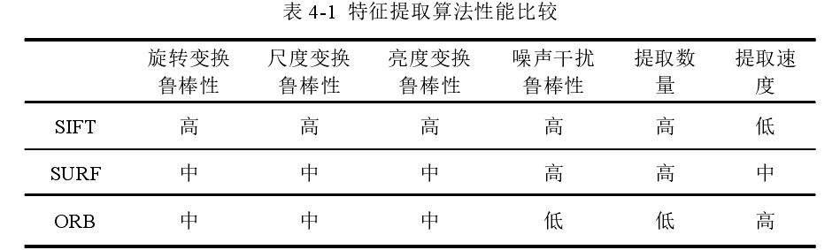
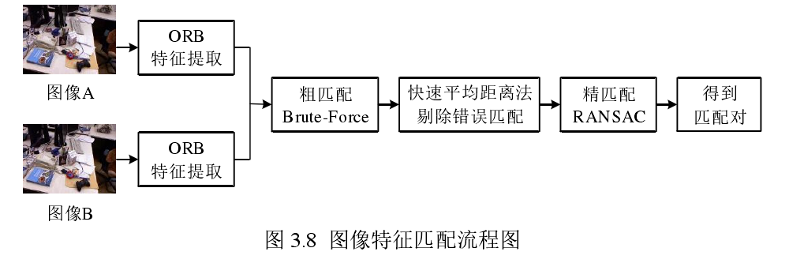
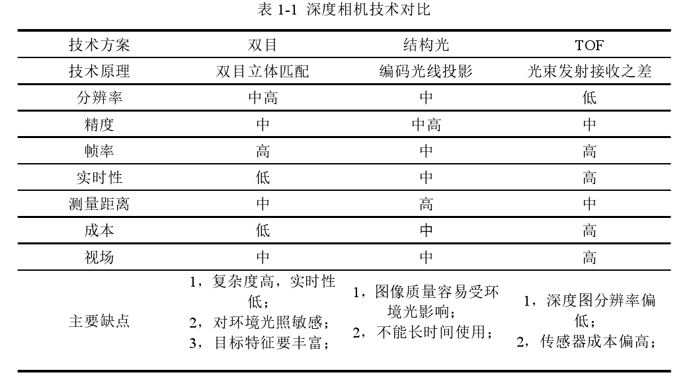
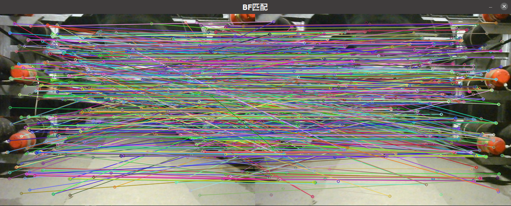
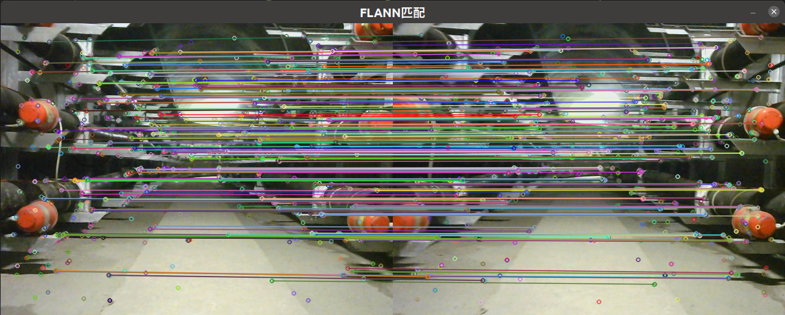
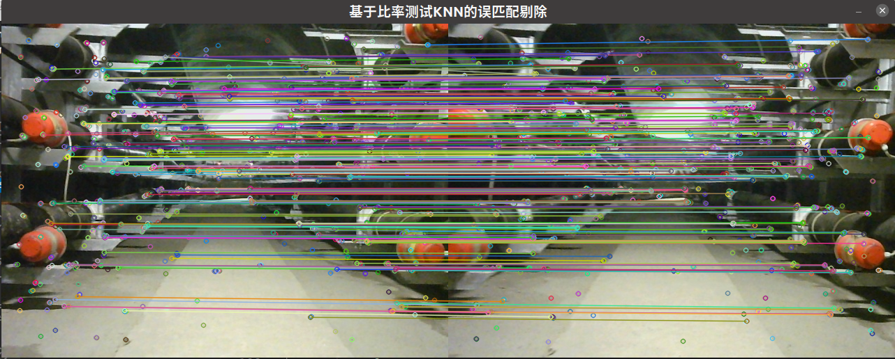
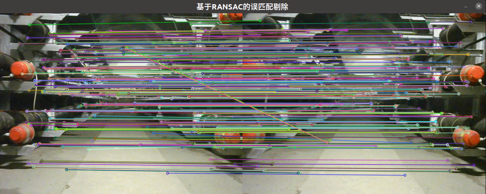
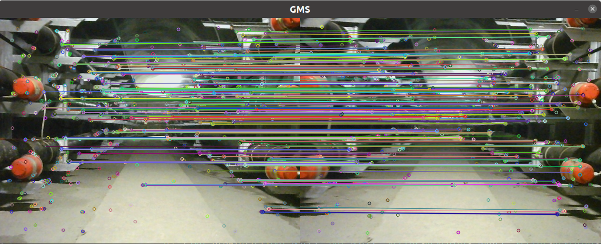

SLAM是机器人领域的关键技术之一，是移动机器人自主导航的关键，也是自主智能移动机器人的核心和基础。仅依赖单目相机信息的SLAM方法过于依赖周围环境的特征信息。由于缺乏场景纹理，光照变化剧烈，动态场景表现不佳，视觉传感器帧率低，无法应对快速运动的情况。惯性测量单元（IMU）可以高帧率输出传感器本身的加速度和角速度，不受环境影响，但漂移严重。为了解决这个问题，本文旨在设计一种结合双目视觉信息和IMU信息的SLAM系统。可在未知环境下实现鲁棒精准定位， 并提供相应的导航地图进行导航。

**为什么使用RGBD传感器？**

传统的视觉SLAM系统以单目或立体相机为输入传感器，这些步骤容易失败，计算复杂，并且会引起噪声测量。

传统上，大多数vSLAM方法低级特征（low-level feature matching ）匹配和多视图几何。这给单目vSLAM带来了一些限制。例如，需要大基线运动来产生足够的视差以进行可靠的深度估计; 并且尺度是不可观察的。这可以通过包括额外的传感器 (例如，立体摄像机、惯性测量单元 (imu) 、声纳) 或系统或场景的先验知识来部分地缓解。另一个挑战是低纹理区域的密集重建。尽管最近使用深度学习的方法在这个方向上显示出令人印象深刻的结果，但仍需要更多有关其成本和对训练数据的依赖性的研究。

RGB-D 相机可同时提供彩色图像和深度图像，越来越多地用于室内场景重建，可用于解决上述挑战。预先校准的相机内在参数为重建和相机跟踪提供了比例因子。并且 RGB-D 相机可以为视野中的所有区域提供深度信息，无论是否有纹理，使得密集重建变得容易，并且无需进行地图初始化。难

图 1 显示了几个最先进的 RGB-D SLAM 系统的重建结果。如今，RGB-D 相机已成为机器人和 AR/VR 室内应用中最受欢迎的传感器。未来，很有希望使用单个 RGB-D 相机或与其他传感器一起使用设计更好的算法来完成 SLAM 任务。

**特征提取方面的改进**

- ORB 特征提取算法

在视觉SLAM前端中，针对图像特征匹配时特征点存在聚集现象导致后续处理出错的问题，对原始的ORB特征提取算法进行改进。算法对图像建立金字塔并在金字塔中分层操作，每一层分块进行特征点检测提取，缓解了聚集现象并有效提高了图像特征分布的均匀性，在特征匹配时设置匹配阈值减少图片误匹配数量，提高了系统的位姿估计精度。

从上表可以看出，SIFT算法的性能是三种算法中最优秀的，但算法的提取速度也是最慢的。SURF改善了SIFT 算法提取速度慢的缺点，但降低了算法在亮度与图像形变方面的鲁棒性。ORB算法与前两种算法相比，虽然检测提取到的特征点数量比较少，但在提取速度上有很大的提升，能满足视觉SLAM对高实时性的要求，因此本文选择ORB算法进行图像的特征提取。

原始的ORB算法在提取图像特征时，提取的特征会有聚集扎堆现象，即特征点都集中在图像中某些区域，而其他区域没有图像特征点。这种情况会使得相机的位姿解算出现误差，轨迹追踪的鲁棒性降低，出现跟踪丢失问题，影响后期的相机跟踪轨迹估计。另外还会降低回环检测时的单张图片信息量，影响全局位姿估计优化的精度，使得SLAM的最终建图精度出现下降。

利用TUM 数据集中的图片进行实验，两种算法都设定检测2000个特征点。图4-3与图4-4分别为opencv自带ORB算法与改进ORB算法的效果图。可以看出在检测相同数量的特征点时，原始ORB算法检测出的特征点有聚集扎堆现象，而改进后的的ORB算法有效避免了这一问题，特征点相比原始ORB算法分布更均匀。

**特征点匹配改进**

在视觉SLAM 中，常用的特征匹配算法有暴力匹配（Brute-Force Matcher)和快速近似最近邻算法(FastLibrary for Approximate Nearest Neighbors，FLANN)[38]。暴力匹配采用的上述第一种方法，这两种方法的不同之处在于:暴力匹配算法是尽可能地找到匹配，因此一定会找到最好的匹配点。由于ORB算法得到的描述子为二进制串，不能使用FLANN 算法。因此，本文中使用 Brute-Force算法。其匹配效果如图3.5所示。

从图3.5可以看出，Brute-Force算法得到的匹配对还存在一些错误匹配，因此需要进一步的处理。

改进：使用快速平均距离法剔除错误匹配

改进：使用RABSAC算法，剔除误匹配；

首先使用改进的ORB算法提取图像A、B的特征点，然后使用Brute-Force算法进行初步匹配;使用快速平均距离法初步去除错误的匹配对，最后再使用RANSAC算法对特征进行精确匹配，得到正确的匹配对。

**考虑光源**

分析感知平台的探测需求，对场景实施补光的光源应满足以下要求:
1，“弱光”场景中直接拍摄的彩色图像属于低照度图像，不能满足平台功能对图像的质量要求。光源补光后应使场景的照度可以提升到接近300lux或者更高，便于获取高质量的彩色图像;
2，平台的环境感知需要颜色正常的场景RGB图像，即光源投射在物体上的光线色度不能干扰物体的固有色。物体在光源下颜色变色的程度称为显色性，具有连续光谱的光源有较好的显色性。而白色就是具有连续光谱的颜色。因此光源光线的颜色应为白色;
3，光源对场景投射的光线不能干扰深度相机获取深度图像。Kinectv2相机通过投射并接收返回的近红外光来产生深度图像，近红外光的波长为830nm，因此光源的波长要与近红外光波长存在差异，避免产生干扰。

根据上述要求本文计划选择雅阁的YG-5201作为补光光源，如图2-6所示。该设备尺寸大小为32mm×52mm×35mm，重量为73g，采用1.5W功率的白色LED光源，LED白光是由多种可见光混合而成，而可见光波长范围在380-760nm，不与近红外光重叠。自带1200mAh的电池，照明时间可持续5小时，光源设备在3m内的照度最高可达500luxo

**考虑线特征，考虑点线融合的方式**

尽管低纹理场景中缺乏足够多可靠的点特征，但仍然可以检测到一定数量的线特征。因此可以考虑引入线特征解决基于点特征SLAM系统在低纹理场景等挑战性环境中效果不佳的困境。

线特征的提取方式：

- EDLines 线段提取算法

EDLines算法则是Cuneyt Akinlar等[32l在2011年提出的线段特征提取算法。其能够在线性时间内给出精确的结果，并拥有比LSD (Line Segment Detector)检测算法更快的提取速度和更高的精确度。

-  RGBD 数据中提取关键线特征

使用EDLines算法可以快速提取RGB图像中的线段，RGBD数据帧除了提供RGB图像信息，还提供了包含各像素深度信息的深度图。因此从RGBD 数据中提取线段，不仅能得到其在二维图像平面的位置信息，还能得到其在相机坐标系下的深度值。结合针孔相机模型可以将RGBD 数据中的线段三角化为三维空间的空间线段。但是，RGBD数据的深度图中存在许多无效点，并且当空间点距离RGBD相机越远时深度值精度越低。因此，直接利用深度图进行三角化会产生大量位置有误的空间线段。

文献[34]指出当深度值小于40b (b指RGBD相机的基线长度）时深度信息更可靠。为了有效利用RGBD数据中的深度信息，本文将从RGBD数据中提取的线段分为两类:双目关键线、单目关键线。其中双目关键线包含深度信息，用公式(2-2)表示，其可直接三角化为空间线段;而单目关键线不包含深度信息，用公式(2-3)表示，其不能直接三角化为空间线段，但可以用于线特征匹配。

**考虑语义分割，加入面特征**

在传统点特征方法的基础上添加了平面特征， 使用连通域分割算法从点云中获取平面特征，并构建伪平面特征， 结合特征点构建点面特征融合的结构约束因子图，构建多重约束关系，用于图优化。   

为解决点特征不足的情况，除了引入多传感器融合外，图像中的其它特征越来越被关注，例如线特征、平面特征、语义特征等[5]。由于彩色图中平面特征不如点特征、线特征容易表示，点、线特征被更多的被用于视觉 SLAM 中。但随着 RGBD 相机的广泛使用，相机在获得 RGB 图像之外还能获取各像素的深度信息，平面特征变得更容易被提取  。

目前， 室内环境下的视觉SLAM问题是VSLAM研究的重点，平面特征是室内环境中常见特征，包含有丰富的空间结构和语义信息，如天花板、桌面、地板、柜子等等。  （改，证明隧道里面弱纹理，平面特征关键即可）

相较于点特征，在环境纹理缺失以及光照变化大的场景下，平面特征能够表现出更强的鲁棒性能。将平面特征添加至 SLAM 系统中，不仅可以添加更多的约束关系，还可以使位姿的估计更加的准确。

为解决弱纹理、多结构特征环境下的SLAM问题，本文基于ORB_SLAM2提出了一种将点面特征融合的RGB-D SALM 方案。本算法**改进点特征的提取方法**，使用更优秀的AGAST方法提取点特征并用四叉树均匀化; 处理RGB-D相机收集的点云，通过积分图获取点云法向量，再使用连通域分割的方式对平面特征提取，基于分割平面的轮廓估计伪平面信息，根据分割平面的边缘特征估计垂直与水平方向的平面特征信息;结合AGAST特征点与所提取的平面特征构建点面特征融合的结构约束因子图，以此添加更多的约束关系，提高SLAM系统的精确性与鲁棒性。

根据线特征信息，考虑弯道检测；

**为什么不使用激光雷达？**

然而，此类自动驾驶定位系统存在一些问题。组合惯导的精度高度依赖良好的GNSS信号，在GNSS信号无法正常接收的场景，即拒止场景下，如树林茂盛的道路、隧道、城市峡谷等区域，GNSS在受到影响后之后基本失效，此时仅依靠IMU或者轮速计等传感器不具备提供准确位姿的能力。
同时，基于激光雷达的定位方法需要建立三维点云地图，大规模地区的数据量达到TB级，而且激光雷达成本昂贵，动辄超过十万元，其计算性能要求也在无人车应用中产生局限性，构成较大使用矛盾。同时，基于双目以及多目视觉传感器的定位系统同样面临复杂的视差计算问题。拒止场景下轻量的定位方案已经成为当前的迫切需要。

---

工作前提:

- 对于这么多传感器，为什么选择RGBD相机作为主传感器，另外为什么考虑融合IMU;
- 对于这么多开源算法，为什么基于ORBSLAM框架，而不是其他框架；
- 对于课题背景，重点的问题是啥？特点是啥？如何解决？

工作一：首先对比各种特征点的优缺点，选择合适的特征点提取方法，并提出改进

工作二：如何提取线特征？使用什么算法？

工作三：RGBD相机可以得到点云数据，基于点云数据做文章？比如如何针对点云数据，使用什么方法提取平面特征？（连通域分割的方式）再比如对点云做优化？

工作四：匹配的时候如何利用点线面进行匹配，并且如何有效的消除误匹配？

工作五：如何基于线特征或者面特征对隧道进行弯道检测？

工作六：为了更好的做导航和定位，建图部分做稠密地图

可不可以

---

① 为什么使用RGBD传感器？

近年来，随着移动机器人和无线传感器网络技术（Wireless Sensor Network，WSN）各自领域的进展迅速，SLAM技术也取得了中的突破与进展。但是，在如电缆隧道等典型的地下场景中，SLAM技术仍面临诸多严苛挑战。

虽然市面上有用于其他场景的巡检机器人，但电缆隧道具有全封闭、特征较少、地面环境较差的特点，因而存在定位不准、地图缺失的问题，目前针对电缆隧道的定位建图研究较少，用于其他场景的定位建图方法大多存在局限性，难以适应该工作环境，GPS或北斗存在信号弱无法定位的问题，采用激光SLAM存在部分区域特征过少，定位偏差的问题，使用IMU的惯性导航存在积分累积误差和成本较高的问题，使用车轮里程计难以解决地面打滑等问题

主要如下:1.有效特征少：电缆隧道中，只有电缆以及电缆架，特征有限，而且地面、墙面等弱纹理特征多；2.视觉传感受阻：在隧道中，往往光照不充分，甚至有些地方完全黑暗，这对光照依赖性强的传感器而言，巡检工作的可靠性存在着巨大的隐患；3.通信受阻：隧道环境是一个拒止场景，GPS信号失效，无法用其进行精准定位。

考虑到电缆隧道等地下场景面临的实际挑战，通常需要感知平台对光学摄像头和激光雷达进行集成和数据融合。但基于这两种传感器开发的感知算法复杂度较高，实时性差，在检测识别场景物体时会受到表面灰度和纹理特征的影响，不能精确识别。此外，还存在成本、功耗和可靠性等多方面的问题，而深度相机在这些方面有相对优势。深度相机价格相对便宜，设备功耗低，可以精确计算深度信息并快速产生深度图片，图片质量受物体外表特征影响小，能够进行更精确的三维感知与重建，而且深度相机在弱光环境下有着良好的性能。因此深度相机非常适合用作电缆隧道等地下环境感知探查的传感器。

但是，由于深度相机自身硬件的限制，输出的深度图像相比传统光学相机获取的彩色图像，在图像质量上仍存在差距。在进行实际场景感知时，场景的光照强度，范围大小等因素也会对图像的采集造成影响，导致深度相机输出的图像出现噪声干扰，深度信息缺失等问题。因此需要用图像去噪算法对深度图像进行去噪修复，同时为场景添加补充光源，使相机在地下电缆隧道场景中也能获得高质量的图像，为后期的图像处理与地图构建打下良好的基础。

另一方面，由于相机在快速运动、光照改变等情况下容易失效，而IMU能够高频地获得机器人内部的运动信息，并且不受周围环境的影响，从而弥补相机的不足；同时，相机能够获得丰富的环境信息，通过视觉匹配完成回环检测与回环校正，从而有效地修正IMU的累计漂移误差。因此，本课题拟采用深度相机和IMU融合的方法。

**选择哪一种深度相机？**

- 三种深度相机技术对比

② SLAM的国内外研究现状和趋势

SLAM技术自1986年来提出以后，已经有近三十年的研究历史，也一直是机器人和计算机视觉方向的研究热点。

视觉 SLAM 工作流程主要可以分为五大部分：信息采集、前端视觉里程计、后端优化、闭环检测、建图。前端视觉里程计通过提取、匹配图像数据中的特征点从而得到路标点并估计出相机当前的位姿，实现实时定位。这期间存在的累积误差由后端优化部分根据帧间的共视关系等方法进行消除，提高跟踪与建图的精度。在位姿估计期间如果有两帧图像的相似度达到一定标准则认为形成了闭环，对两帧图像之间的所有路标点和位姿进行一次优化，经过优化处理过的路标点最终用于建图，建图的精度将直接影响后续动态路径规划、实时避障等工作的效果。  

2007年Andrew Davison 提出的 MonoSLAM 通过在每帧图像中提取稀疏的特征点来进行位姿估计，能够在概率框架内在线运行，这是第一个使用单目相机完成的实时视觉SLAM系统，是基于扩展卡尔曼滤波器( extended Kalman filter，EKF）方法的视觉SLAM，有着良好的实时性。

2007年 Georg Klein和 David Murray提出了PTAM3]l ( parallel tracking and mapping)，为了解决MonoSLAM 计算复杂度高的问题，PTAM对视觉里程计部分做出了优化，不再逐帧提取特征点，而是在一部分图像序列中选出最具有代表性的一帧作为关键帧，只处理关键帧中的特征点，降低了计算的复杂度。在PTAM 中，首次出现了前后端的概念，这也为后来出现的视觉SLAM方法提供了良好思路。并且PTAM是第一个使用非线性优化的方法，也是第一个将BA与视觉SLAM 相结合的方法。但是PTAM缺少闭环检测模块，无法对相机位姿和地图进行更好地优化。

2011 年 Newcombe 等人提出了一个单目视觉 SLAM 系统 DTAM[5]（ dense tracking and mapping） ,
该方法属于直接稠密法，其依然延续了处理关键帧的思想，DTAM 不需要单独对特征点和描述子进行详细的计算，既减少了特征点的计算时间，也避免了弱纹理场景中特征点缺失导致的跟踪失败问题。 DTAM 有着稳定的定位与建图效果，但是其工作都是在默认光照环境不变的条件下进行的，因此对光照强度变化比较敏感。

2014年Jakob Engel等人提出了LSD-SLAMI6] ( large-scale direct monocular SLAM），是一个半稠密的单目视觉SLAM，后来又将这种方法成功的移植到了双目和RGB-D相机上，它不使用特征点，而是将关注点放到了像素梯度与直接法的关系上，提取梯度较为明显的像素，通常情况下是物体的边缘线条， 使用方差归一化后的光度误差对图像的梯度进行跟踪生成半稠密深度图。  实验表明，在稳定的运动环境下， LSD-SLAM 能将相机轨迹的绝对误差限制在 2 cm 内。但目前来说半稠密法获得的点云数量仍然不足，还存在着尺度漂移，对相机曝光参数非常敏感，相机快速移动时容易丢失目标等问题，且没有基于直接法的闭环检测，依然需要以特征点法的方式进行闭环检测。  

2014年Forster等人提出了SVOl7l ( semi-direct monocular visual odometry)，它结合了特征点法和直接法的优点，是稀疏直接法视觉里程计，并使用提出的深度滤波器估计特征点的位置。但是，由于其缺少了后端优化和闭环检测功能，对相机位姿的估计具有较为明显的累积误差，非常依赖于位姿估计的准确性，一旦跟踪失败很难重新定位，因此SVO 的建图功能非常有限，不算一个完整的 SLAM。

2015年Raul Mur-Artal等人提出了基于单目相机的视觉SLAM系统ORB-SLAM 8l，2017年又提出了ORB-SLAM2I19]，在上一代的基础上增加了对双目和RGB-D相机的支持，具有广泛的适用性，在2020年又提出了ORB-SLAM310]，实现了相机与惯性测量单元（ inertial measurement unit，IMU)的结合，通过外加传感器提升了视觉SLAM 的性能。ORB-SLAM在先前传统的PTAM框架下添加了闭环检测模块，使用了Tracking、LocalMapping、Loop Closing三线程并行的方案，在静态环境下定位准确且系统鲁棒性强，能够达到实时效果。经过多组实验证明， ORB-SLAM在相机快速移动的状态下依然能够保持良好的跟踪状态，鲁棒性远大于之前的 PTAM 和 LSD-SLAM，但是单目跟踪在缺少闭环条件的大运动场景中会产生较大的漂移量[12]。 ORB-SLAM 对每一帧图像都进行 ORB 特征点提取非常耗时，地图由稀疏特征点组成精度较低，且对动态环境较为敏感，在动态环境下容易跟踪失败。  

---

BF一共有1005对匹配对:最直接方法就是暴力法（BruteForce），即通过遍历所有的可能，使得它总能够找到最佳匹配。而这种方法，在图像中提取数据量过大的情况下高耗时的弊端也非常明显，这与 SLAM 系统所追求的实时性的期望不相符。

基于经验的汉明距离的误匹配剔除

FLANN一共有317对匹配对:快速近似最近邻搜索算法（Fast Library for Approximate Nearest Neighbors, FLANN）通过扩展至高维空间中快速搜索近邻，从而避免局部敏感哈希 [67] 的影响，实现在最快的时间内找到一个相对优秀但不一定是最佳的结果。

室内环境下基于 FLANN 算法的匹配结果。但是当前的匹配结果中存在肉眼可见的错误匹配，需要进一步优化，在不引入错误的同时去除当前匹配结果中误匹配。

错误匹配主要包括两个方面：1.未检测出本该匹配的特征点对；2.将不相关的特征点检测为匹配点对。前者未检测出匹配的遗漏现象归根于检测算法准确性不足，而对于后者产生匹配的错误性问题则可以通过进一步剔除错误的匹配以提高匹配精度。

基于比率KNN：**https://www.cnblogs.com/feifanrensheng/p/9168627.html**

Get total 295 matches.

基于RANSAC

Get total 534 matches.

GMS

Get total 394 matches.

一共有1003个特征点
ORB特征提取耗时53.8228 ms
FLANN get total 1002 matches.
FLANN匹配耗时11.7635 ms
Get total 291 matches.
GMS Filter去除误匹配耗时2.84244 ms
总计耗时68.546 ms

一共有1004个特征点
ORB特征提取耗时56.9504 ms
FLANN get total 1003 matches.
FLANN匹配耗时12.3649 ms
Get total 292 matches.
GMS Filter去除误匹配耗时2.55797 ms
总计耗时71.9775 ms

一共有1004个特征点
ORB特征提取耗时55.064 ms
FLANN get total 1003 matches.
FLANN匹配耗时13.1068 ms
Get total 292 matches.
GMS Filter去除误匹配耗时2.56958 ms
总计耗时70.8544 ms

2.55797 +2.56958 +2.84244 =

---

一共有1007个特征点
ORB特征提取耗时56.3177 ms
FLANN get total 1005 matches.
FLANN匹配耗时11.5826 ms
Get total 525 matches.
RANSAC Filter去除误匹配耗时8.85694 ms
总计耗时76.8875 ms

一共有1007个特征点
ORB特征提取耗时56.7376 ms
FLANN get total 1005 matches.
FLANN匹配耗时11.0409 ms
Get total 525 matches.
RANSAC Filter去除误匹配耗时9.32515 ms
总计耗时77.2208 ms

一共有1007个特征点
ORB特征提取耗时55.7894 ms
FLANN get total 1005 matches.
FLANN匹配耗时12.1415 ms
Get total 525 matches.
RANSAC Filter去除误匹配耗时9.69692 ms
总计耗时77.7181 ms

---

一共有1007个特征点
ORB特征提取耗时56.6675 ms
FLANN get total 1005 matches.
FLANN匹配耗时12.0604 ms
Get total 295 matches.
KNN Filter去除误匹配耗时10.1587 ms
总计耗时79.0542 ms

一共有1007个特征点
ORB特征提取耗时62.7126 ms
FLANN get total 1005 matches.
FLANN匹配耗时11.846 ms
Get total 291 matches.
KNN Filter去除误匹配耗时9.75781 ms
总计耗时84.4272 ms

一共有1007个特征点
ORB特征提取耗时58.7028 ms
FLANN get total 1005 matches.
FLANN匹配耗时9.90512 ms
Get total 295 matches.
KNN Filter去除误匹配耗时11.1479 ms
总计耗时79.8631 ms

一共有1007个特征点
ORB特征提取耗时56.3982 ms
FLANN get total 1005 matches.
FLANN匹配耗时12.7253 ms
Get total 292 matches.
KNN Filter去除误匹配耗时9.55006 ms
总计耗时78.8007 ms

一共有1005个特征点
ORB特征提取耗时59.4873 ms
FLANN get total 1003 matches.
FLANN匹配耗时10.7079 ms
Get total 290 matches.
KNN Filter去除误匹配耗时17.5389 ms
总计耗时87.9108 ms

一共有1007个特征点
ORB特征提取耗时57.4937 ms
FLANN get total 1005 matches.
FLANN匹配耗时14.0852 ms
Get total 293 matches.
KNN Filter去除误匹配耗时10.6815 ms
总计耗时82.422 ms

一共有1006个特征点
ORB特征提取耗时59.1004 ms
FLANN get total 1004 matches.
FLANN匹配耗时11.6019 ms
Get total 290 matches.
KNN Filter去除误匹配耗时10.6033 ms
总计耗时81.4472 ms

| **评价指标**       | **RANAC**    | **比率测试**  | **GMS**         |
| ------------------ | ------------ | ------------- | --------------- |
| **匹配数量（对）** | 525          | 293           | **291**         |
| **匹配耗时（ms）** | 9.293/77.672 | 11.348/81.989 | **2.67/70.459** |
| **匹配占比（%）**  | 11.96        | 13.841        | **3.79**        |

**面向电缆隧道环境下的基于双目视觉惯导的移动机器人定位方法研究**

**Research on mobile robot positioning method based on binocular visual inertial navigation in cable tunnel environment**

电缆隧道机器人通过在隧道中精确的自主定位，实现对电缆本体运行状态监测、电缆隧道内环境监测、电缆隧道内多传感器联动、电缆隧道安防等功能，综合提升对电缆隧道工作环境感知及工作状态评估能力，提升隧道管理的便捷性以及快速响应能力。首先结合电缆隧道低纹理场景的特点，对特征的提取与匹配进行优化，以提高机器人的定位精度；其次，针对纯视觉在相机快速运动导致系统无法使用的缺陷，考虑使用多传感器融合的方案，对双目和IMU进行信息融合。本课题为国家重点研发项目课题，基于ROS开放平台，采用IMU与双目视觉相结合，基于SLAM的定位方法进行研究。

