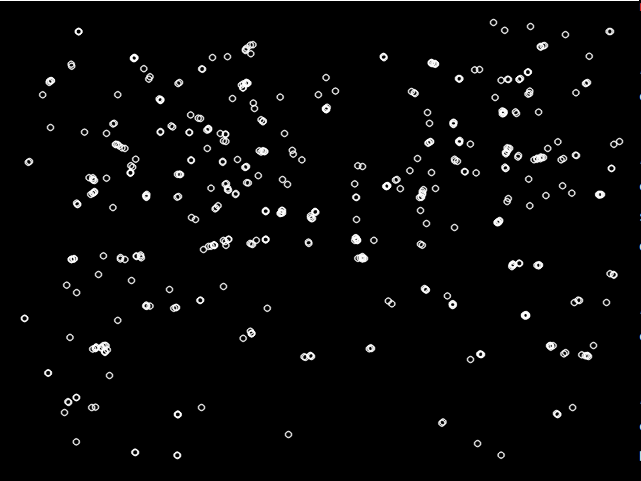
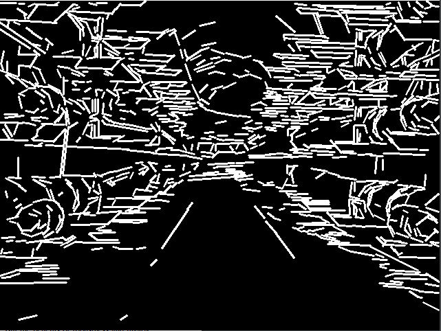

```C++
#include "ORBextractor.h"
#include "tic_toc.h"
#include <opencv2/xfeatures2d.hpp>


int main(int argc, char **argv)
{
     if (argc != 2)
     {
          cout << "Please put an image!" << endl;
     }
     Mat img = imread(argv[1], CV_LOAD_IMAGE_COLOR).clone();
     Mat gray_img;
     cvtColor(img, gray_img, CV_BGR2GRAY);

     vector<KeyPoint> orb_keypoints;
     Mat orb_descriptors;
     ORB_SLAM2::ORBextractor orb_extractor(200, 1.2f, 8, 20, 8);
     // 重载方法
     TicToc start_1;
     orb_extractor(gray_img, Mat(), orb_keypoints, orb_descriptors);
     cout << "A total of " << orb_keypoints.size() << " feature points are extracted by ORB"
          << " and cost " << start_1.toc() << "ms" << endl;

     Mat orb_img;
     // 创建黑色图像
     Mat outImage(img.size(), CV_8UC3, cv::Scalar(0,0,0));
     // 绘制关键点
     drawKeypoints(outImage, orb_keypoints, outImage, cv::Scalar(255,255,255), cv::DrawMatchesFlags::DEFAULT);

     // drawKeypoints(img, orb_keypoints, orb_img, Scalar::all(-1), DrawMatchesFlags::DEFAULT);
     imshow("ORB特征提取", outImage);
}

```

打印输出：

```haskell
A total of 510 feature points are extracted by ORB and cost 19.6845ms
```







与从图像中提取的点特征相比，组合点和线段可以提供更丰富的周围环境信息。