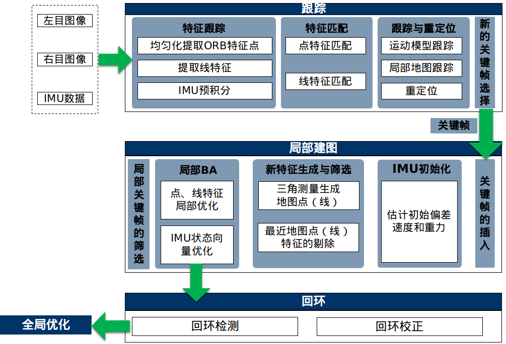
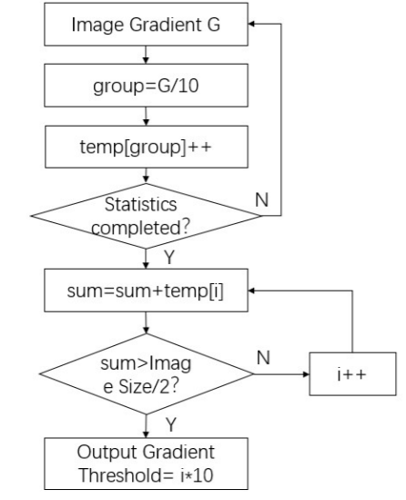
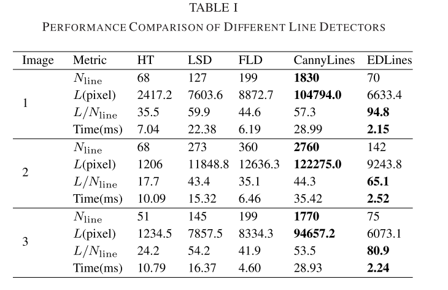
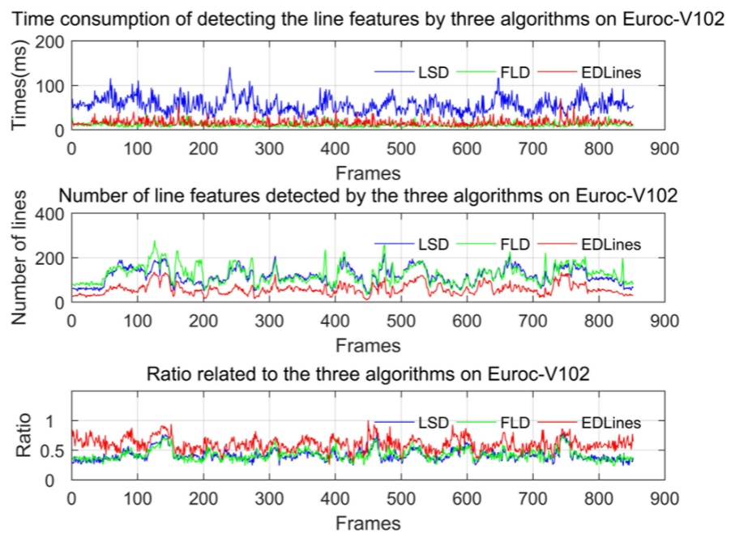
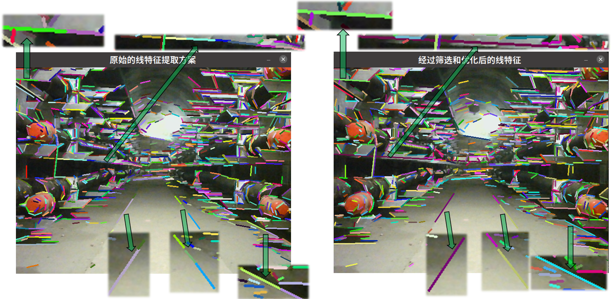
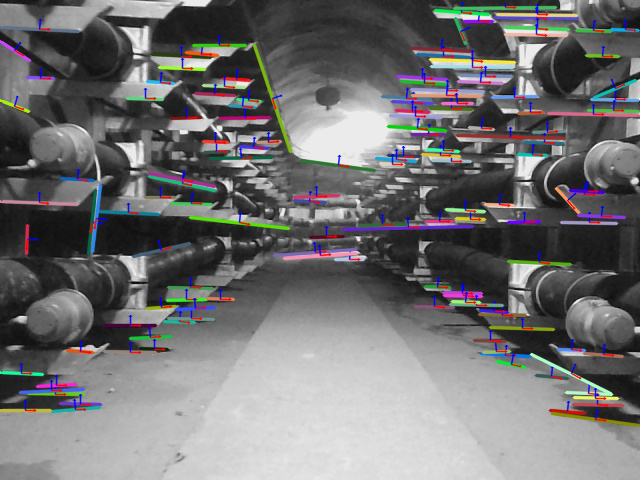

# 面向电缆隧道的点线融合的SLAM系统

# 摘要

电缆隧道环境复杂、通信不畅、空间狭小，且电缆线会出现老化及腐蚀存在火灾隐患的问题，巡检机器人可以代替人工通过日常巡检，提早发现隐患，但传统的基于点特征的视觉SLAM方案，在电缆隧道环境存在定位难度大、地图信息缺失的问题。鉴于以上问题，本文提出了一种针对电缆隧道场景下的点线融合的视觉惯导SLAM，利用点线特征融合的策略，在特征单一、结构相似的电缆环境下获得了很好的鲁棒的结果。首先，基于电缆隧道中存在大量线段叠加导致的大量短线、断线问题，本文在原始的 EDLine 算法的基础上进行了改进，利用近线合并、断线拼接、长度抑制等策略，提高了线特征的匹配精度。其次，针对电缆隧道中多个场景的纹理特征的分布不同，本文提出了一种自适应的点线融合策略，提高系统的整体定位精度以及实时性效果。通过在电缆隧道下的数据集和真实场景下得到的仿真实验结果可知 ， 所提出的算法具有较高的定位精度以及良好的鲁棒性。

# 1.引言

随着电缆隧道的普及和发展，电缆隧道中存在的安全隐患也日益增加，尤其是电缆老化而导致的火灾问题，严重影响了正常的电力供应，并造成了巨大的经济损失。电缆隧道中的日常巡检工作是保障电缆隧道安全稳定运行的重要前提和有力保障。由于电缆隧道具有设备分布繁杂、总里程长的特点，且隧道内的环境容易出现积水、空气不流通、高辐射等问题，传统的人工巡检工作具有很大的局限性，因此，迫切需求一种巡检机器人代替人工进行巡检。随着增强现实、无人机、机器人等领域的快速发展，同步定位与建图(SLAM) 技术也受到广泛关注，SLAM技术可以帮助移动机器人在陌生环境中进行自主定位，并逐步建立一致的周围环境地图，进而为机器人提供先验信息，实现其在未知环境下的巡检工作。

近年来，提出了几种不同类型的SLAM方案，从SLAM与传感器的结合的角度来看，主要分为基于激光雷达的激光SLAM（Lidar SLAM）以及基于相机的视觉SLAM（Visual SLAM）。随着相机采集能力的不断增强，人们可以从环境中获取大量丰富的纹理信息，这使得视觉SLAM具有更强的场景识别能力，尤其是在弱纹理场景下，更加受到研究者的关注。而早期的激光SLAM虽然测量精度较高，但是存在感知算法复杂度较高、成本高、在结构化场景（尤其在电缆隧道、长廊等结构单一的室内环境）下退化严重等问题，因此，在此类场景下，视觉SLAM的研究备受关注。而纯视觉方案在相机运动过快或光照变换大的情况下容易出现跟踪丢失，导致系统崩溃的问题，目前常采用多传感器融合的策略，如视觉惯导融合策略就是一种有效的融合策略，与视觉融合GPS信号相比，前者不受室内环境制约，且相机和惯性测量单元（Inertial Measurement Unit, IMU）都具有低成本、轻量化的特点，更加适用于电缆隧道中机器人巡检工作的进行。经典的视觉与惯导的耦合方案有松耦合和紧耦合，其中松耦合是视觉和惯导两个模块独立进行运动估计后进行间接融合，紧耦合则是使用两个模块的原始测量数据直接融合后再进行运动估计。紧耦合在算法复杂度上更高，但是其更加充分地利用了传感器的信息，可以获得精度更高的全局一致性结果，如 OKVIS，VINS-Mono， ROVIO等。 从视觉惯导里程计（Visual Inertial Odometry，VIO）的实现方法来看，SLAM可以分为基于直接法的SLAM和基于特征法的SLAM，两者主要区别在于计算相机位姿与地图点的位置的方式不同，前者通过最小化光度误差（Photometric Error）的方式计算，而后者则通过最小化重投影误差的方式计算。

值得注意的是，虽然在VIO领域取得了很大的进步，但在电缆隧道等低纹理环境中仅使用点特征的VIO的性能很差，因为在这种情况下很难提取足够的点特征。与点相比，线段传达周围环境的几何结构方面具有优势，并且对光照变化的敏感度更低，更有利于表示隧道环境。因此，结合点特征和线特征将为SLAM系统提供更多的几何约束，可以更好地表达环境并提供丰富的视觉信息，提高里程计系统的鲁棒性和准确性。

尽管点线融合的SLAM方案有许多优点，但在实际场景应用下仍具有很有困难。**首先**，同时检测点线特征需要以付出更高的计算成本的为代价，以 PL-VIO 为例，提取线段特征的时间是提取点特征的五到八倍，严重影响了其实时性。**其次**，由于电缆隧道中线特征错综复杂，存在很多交叉线导致的短线或断线特征，传统的线特征提取方案会造成较高的误匹配率。**最后**，由于隧道中不同的场景（如直道、弯道以及暗光等场景）下的特征纹理的分布也不同，如何更加有效的分配点线特征提取的数目，对最终系统的定位精度以及实时性都有直接影响。 这些问题都使得点线特征融合的SLAM在电缆隧道中的应用充满了挑战。

为了解决这些问题，首先，本文引入了一种不需要参数调整的线性时间线段检测器——EDLines，并基于电缆隧道场景特点，对EDLines的线特征提取策略进行优化，以降低误匹配率，提高匹配精度。其次，本文提出了一种自适应的点线融合策略，。。。。。最后，通过最小化由滑动窗口优化框架中的视觉特征重新投影误差和预集成的IMU误差组成的成本函数来优化状态。

# 2.系统概述

> 图一：系统概述

该系统建立在ORBSLAM2的基础上，

具有三个并行的线程，包括跟踪，局部建图和回环。1)跟踪在每一帧中定位相机姿势，通过查找与局部地图匹配的特征并最小化点和线特征的重投影误差来定位每一帧的摄像机的跟踪。2)局部建图维护动态地图，并对其进行优化，执行局部BA，其中包括关键帧，地图点 (地图中的3D点) 和地图线 (地图中的3D线段)。3)回环通过执行姿势图优化来校正累积的漂移。该线程启动第四个线程以在姿势图优化后执行全局优化，以计算最佳结构和运动解决方案。

## 前端里程计

输入数据由摄像机图像和IMU测量信息组成。对于图像信息，它分为两个并行过程，即点特征跟踪和线特征跟踪。点特征跟踪过程采用四叉树均匀化特征点的方法提ORB点特征，采用金字塔型LK光流方法进行点特征跟踪。线特征跟踪过程利用改进的EDLine线提取方法提取线特征，利用提出的线特征匹配方法进行线特征跟踪。对于IMU测量信息，IMU数据被预集成以获得当前时刻的姿势，速度和旋转角度。同时，计算出IMU在相邻帧，协方差矩阵和Jacobi矩阵之间的预积分增量，这将用于后端优化。

空间点和线分别由逆深度 [43] 和普吕克坐标 [44] 表示。基于这些3D特征，仅视觉SFM使用PnP方法 [45] 来估计滑动窗口中所有帧的姿势。然后，将visual SFM与IMU预积分对齐，以解决初始化参数，包括比例，重力，速度和偏差。

初始化后，通过最小化具有视觉和IMU约束的目标函数，在固定大小的滑动窗口中对视觉和惯性状态变量进行非线性优化。滑动窗口中的其他约束项包括从边缘帧生成的先验信息和当检测到循环闭合时生成的循环闭合约束。其中，边缘化是指在添加新帧时删除最旧帧或子新帧。在这里，边缘化是基于Schur补码方法 [46]。局部VIO的非线性优化产生精确的状态。

# 3.融合点线特征的跟踪

跟踪线程首先需要对关键帧进行特征提取。为了更好的保证时效性，采用并行提取点特征和线特征的方式。点特征由四叉树均匀化特征点的方法进行ORB提取，以及256位ORB描述符描述。为了在保证实时性的同时，还能获得高准确性的线特征，本文针对电缆隧道场景的特点对EDLine线段提取算法进行了改进。此外，鉴于电缆隧道中各个场景的纹理特征分布不同，我们还提出了一种自适应的点线融合策略，以应对这些变化。

## 3.1 EDLine线特征提取算法

EDLine是一种基于梯度且不需要参数调整的线性时间线段检测器，与目前常用的LSD或FLD线特征提取算法相比，EDLine 具有更快的检测速度。但是，由于电缆隧道中大量线段叠，这几种线特征提取算法很容易导致检测短线、断线问题，所以，本文在原有算法的基础上，本文通过近线合并、断线拼接、长度抑制等方法，有效地解决了，提高了线特征的匹配精度。

改进的EDLine线特征提取算法流程图如下图所示：

### 1) 图像畸变校正

由于拍摄条件或相机结构，获取的图像会出现扭曲或偏移的现象，称之为畸变。图像畸变主要分为径向畸变和切向畸变，当镜头不平行于像平面时还会发生切向畸变，类似于透视变换。一般来说，中心处的畸变最小，畸变随半径增大而增大。畸变校正首先需要进行相机标定，从而得到内部参数矩阵和畸变系数，然后先对整张图像进行去畸变，得到去畸变后的图像，最后讨论此图像上的点以及线的空间位置。

### 2) 自适应GAMMA 校正

由于隧道环境中有部分弱光环境，即使使用补光的情况下，仍然不可避免阴影的遮挡，因此，本文结合了自适应伽马校正技术 [50]，动态调整图像的亮度值。自适应伽马校正的伽马值由图像的亮度决定。对于弱光图像，伽玛值始终小于1。较低的图像亮度导致较小的伽玛值和较高的亮度改进。如图所示，在使用GAMMA校正后，可以提取更多的线特征，更有利于特征的匹配，提高跟踪精度。

> 50 vS 85

### 3) 噪声抑制

在电缆隧道环境下，由于光线较差，图像往往会受到噪声干扰。噪声会导致图像质量下降，影响图像点线特征的提取，使得帧间匹配精度下降。使用高通滤波器，通过模糊每个像素及其相邻像素来减少图像中噪声的影响。选择 $σ = 1$ 的标准 $5\times5$ 高斯核来实现这一点。

### 4) 计算图像梯度值和方向

计算图像梯度值和方向: 在此步骤中，计算平滑图像上每个像素的梯度值。在这个阶段，可以使用任何已知的算子，例如Prewitt算子、Sobel算子、Scharr算子等等。考虑到时间效率和精度，本文选择 Sobel 线性算子。计算像素 $(x,y)$ 处的梯度幅度和水平线角的公式如下:

$$
\begin{align*}
g_x(x,y)&=\frac{I(x+1,y)-I(x,y)+I(x+1,y+1)-I(x,y+1)}{2}\\
g_y(x,y)&=\frac{I(x,y+1)-I(x,y)+I(x+1,y+1)-I(x+1,y)}{2}\\
\end{align*}
$$

$$
g(x,y)=\sqrt{g_x(x,y)^2+g_y(x,y)^2}\\
angle(x,y)=arctan\left(\frac{g_x(x,y)}{-g_y(x,y)}\right)
$$

其中，$I(x,y)$ 是输入图像在像素 $(x,y)$ 处的强度， $g(x,y)$ 是梯度幅度，角度 $angle(x,y)$ 是水平线角。

### 5) 计算图像梯度阈值

自定义梯度阈值

### 6) 锚点与边缘图绘制

在此步骤中，我们计算一组在边缘元素中概率非常高的像素，称之为锚点。它们对应于梯度算子产生最大值的像素，最大值是梯度图的峰值。然后，通过

在锚点之间绘制边缘来连接在步骤5) 中获得的锚点，这称为边缘绘制 [13]。边缘绘制的过程从一个锚开始，并使用相邻像素的梯度大小和方向通过梯度最大值到达下一个锚。在此阶段，边缘绘制不仅生成二进制边缘图，还生成一组边缘段，这些边缘段是与对象边界相对应的像素链。

### 7) 线特征提取与优化

这一步的目标是将上一步提取的像素链分成多条线段。思路是遍历像素点，用最小二乘法将直线拟合到像素点，直到误差超过某个阈值（比如1个像素点）。当误差超过这个阈值时，就会生成一个新的线段。然后递归地处理链中的其他像素，直到该过程完成。

## 3.2 线特征的优化

### 一些参数的表示

用户定义和自适应阈值和参数。

$\tau_{\theta}$  用户定义的**角度接近度阈值**，用于根据绝对角度差计算等式。

$\xi_s$  用于计算**自适应空间接近阈值** $\tau_s$ 的用户定义**空间接近度**参数。

$\tau_s$  基于绝对轴对齐距离对线段进行分组的**自适应空间接近阈值**。

$\tau_{\theta}^*$ 根据角度差、长度和最近距离合并线段对的**自适应角度接近度阈值**。

之后使用 $\mathcal{D}$ 表示检测到的线段集合，使用 $\mathcal{L}$ 表示合并线段的集合。对于一对线段 $(L_1,L_2)$ ，我们使用 $(l_1,l_2)$ 和 $(\theta_1,\theta_2)$ 分别表示它们的长度和角度。对于任一条线段 $L_i$，我们使用 $(s_{ix},s_{iy})$ 和  $(e_{ix},e_{iy})$ 表示两个端点。

**空间接近：**线段必须在空间上足够接近才能被分组。 

**角度接近:** 线段的方向应该彼此相差不大。

可合并性与较短段的长度、角度差和相对空间距离成反比，并且与较长段的长度成正比。因此，引入了与长度和距离有关的阈值来进行可合并性决策。

由于可合并性与较长段 $L_1$ 的长度 $l_1$ 成正比，因此可以自适应地将空间接近度的阈值设置为：
$$
\tau_s = \xi_sl_1
$$
其中 $0 < \xi_s < 1$ 是用户指定的分数。对于每个线段 $L_1$ ，自适应空间接近阈值 $\tau_s$  确定最近点 $c_1$ 和 $c_2$ 之间距离 $d$ 的最大允许值。例如，$\xi_s=0.1$ 意味着线段 $L_1$ 的空间接近阈值是 $L_1$ 长度的 $10\%$。

为了结合线段的合并性和长度 $l_2$  的较短线段之间的反比关系，我们首先通过其最大允许值 $l_1$ 对 $l_2$ 进行归一化。因此，我们获得归一化长度：
$$
\hat{l}_2 = \frac{l_2}{l_1}
$$
类似地，我们通过其最大允许值 $\tau_s$ 对最近距离 $d$ 进行归一化。这给了我们归一化的距离：
$$
\hat{d}= \frac{d}{\tau_s}
$$
组合的归一化长度和距离约束可以计算为：
$$
\lambda=\hat{l}_2+\hat{d}
$$
当 $l_2$ 和 $d$ 都较小时，可合并性增加，$\lambda$ 减小。最后，该自适应长度和距离约束用于自适应地调整角差阈值 $\tau_{\theta}$ 为：
$$
\tau^*_{\theta}=\left(1-\frac{1}{1+e^{-2(\lambda-1.5)}}\right)\tau_\theta.
$$

### 合并步骤

$Step 1:$  根据传统的空间和角度接近度度量对线段进行分组

首先**按线段长度**对提取出的线段进行**降序排列**，得到 $\{L_1，L_2,…,L_n\}$，其中 $L_n$ 表示第 $n$ 条线段 ;

设当前最长线段为 $L_1$，则剩余线段的集合为：$L = \{L_2,L_3,...L_n\}$；

选择 $L_1$ 角度接近的线段组 $\mathcal{P}_{L_1}$ ：
$$
\mathcal{P}_{L_1} = [\forall L_i\in\mathcal{L}:(|\theta_i - \theta_1|<\tau_{\theta})].\quad i\in[2,n]
$$
使用空间接近度进一步过滤集合  $\mathcal{P}_{L_1}$ ：

- 水平距离：

  - 近线合并
    $$
    \mathcal{P}_{L_1}=\left\{ \forall L_i,L_j\in \mathcal{P}_{L_1}:\left( \left| x_{s_i}-x_{s_m} \right|<\tau_s \right) \lor \left( \left| x_{e_j}-x_{e_m} \right|<\tau_s \right) \right\}
    $$

  - 断线拼接
    $$
    \mathcal{P}_{L_1}=\left\{ \forall L_u,L_v\in L_{\alpha}:\left( \left| x_{e_u}-x_{s_m} \right|<\tau_s \right) \lor \left( \left| x_{s_v}-x_{e_m} \right|<\tau_s\right) \right\}
    $$

  垂直距离

  - 近线合并

  $$
  \mathcal{P}_{L_1}=\left\{ \forall L_i,L_j\in \mathcal{P}_{L_1}:\left( \left| y_{s_i}-y_{s_m} \right|<\tau_s \right) \lor \left( \left| y_{e_j}-y_{e_m} \right|<\tau_s\right) \right\}
  $$

  - 断线拼接

  $$
  \mathcal{P}_{L_1}=\left\{ \forall L_u,L_v\in L_{\alpha}:\left( \left|y_{e_u}-y_{s_m} \right|<\tau_s \right) \lor \left( \left| y_{s_v}-y_{e_m} \right|<\tau_s\right) \right\}
  $$

$Step2:$ 考虑每个组中的成对线段，如果它们满足我们的可合并标准，则将它们合并为单个线段。重复这两个步骤，直到不能再合并线段。

$Step3: $ 合并成功后则需要进一步检验，如果对较长的线段 $L_1$ 和合并的线段 $M$ 的绝对角度差大于 $\frac{\tau_{\theta}}{2}$，将放弃合并。此阈值的额外严格性是为了确保合并的段不会偏离较长的线段 $L_1$ 太远。

## 3.3 线特征匹配

## 3.3 自适应点线融合策略

# 4.基于点和线的后端优化

## 4.1 线特征的参数化表示

为了简化3D线的变换和投影，使用 plucker 坐标对3D线进行参数化。假设3D线 $L$ 的两个空间点是 $\mathbf{X}_1$, $\mathbf{X}_2$。它们对应的齐次坐标为 $\mathbf{X}_{1}=\left(x_{1}, y_{1}, z_{1}, w_{1}\right)^{T}$ 和 $\mathbf{X}_{2}=\left(x_{2}, y_{2}, z_{2}, w_{2}\right)^{T}$。非齐次坐标表示为$\widetilde{\mathbf{X} }_{1}$ 和 $\widetilde{\mathbf{X} }_{2}$。

这条3D线的 plucke r坐标可以表示为：
$$
\mathcal{L}=\left[
\begin{array}{c}{\widetilde{\mathbf{X}}_{1} \times \widetilde{\mathbf{X}}_{2}} \\ {w_{1} \widetilde{\mathbf{X}}_{2}-w_{2} \widetilde{\mathbf{X}}_{1}}\end{array}
\right]=\left[\begin{array}{l}{\mathbf{n}} \\ {\mathbf{v}}\end{array}\right]\in \mathbb{R}^{6}
$$
其中 $\mathbf{n}\in\mathbb{R}^3$ 是过该直线且通过原点的平面的法向量，由线和坐标原点确定的法向， $\mathbf{v}\in\mathbb{R}^3$直线的方向向量，且 $\mathbf{n}^{\mathrm{T}} \mathbf{v}=0$ 。但是，对于普朗克矩阵，使用的 $6$ 参数的形式大于空间直线的 $4$ 个自由度，且存在正交约束，因此普吕克坐标是一种过参数化的表示，这将导致额外的计算成本和系统的数值不稳定。因此参考 Bartoli 和 Sturm 提出的$4$ 参数的最小化表示方法，即正交表示法。

正交表示法将 $\mathbf{n,v}$ 组成如下增广矩阵 $\mathbf{[n|v]}$，然后进行 $QR$ 矩阵分解，由于存在正交约束 $\mathbf{n}^T\mathbf{v} =0$，因此其分解的结果比较特殊：
$$
\begin{align*}
\mathcal{L}=[\mathbf{n} | \mathbf{v}]
&=\left[\frac{\mathbf{n}}{\|\mathbf{n}\|} \quad \frac{\mathbf{v}}{\|\mathbf{v}\|} \quad \frac{\mathbf{n} \times \mathbf{v}}{\|\mathbf{n} \times \mathbf{v}\|}\right]\left[\begin{array}{cc}{\|\mathbf{n}\|} & {0} \\ {0} & {\|\mathbf{v}\|} \\ {0} & {0}\end{array}\right]
=\mathbf{U_{3\times3} }\mathbf{W_{3\times2} }\in\mathrm{SO(3)}\times\mathrm{SO(2)}
\end{align*}
$$

$$
\mathbf{U}=\mathbf{R}(\psi_x,\psi_y,\psi_z)
=\left[\frac{\mathbf{n}}{\|\mathbf{n}\|} \quad \frac{\mathbf{v}}{\|\mathbf{v}\|} \quad \frac{\mathbf{n} \times \mathbf{v}}{\|\mathbf{n} \times \mathbf{v}\|}\right]\in\mathrm{SO(3)}
$$

由于 $d=\frac{\|\mathbf{n}\|}{\|\mathbf{v}\|}$ 为直线到原点的距离，只有一个自由度，所以可以用三角函数矩阵参数化：
$$
\mathbf{W}=
\left[\begin{array}{cc}{\cos (\phi)} & {-\sin (\phi)} \\ {\sin (\phi)} & {\cos (\phi)}\end{array}\right]
=\frac{1}{\sqrt{(\|n\|^2+\|v\|^2)} }\left[\begin{array}{cc}{\|n\|} & {-\|v\|} \\ {\|v\|} & {\|n\|}\end{array}\right]\in\mathrm{SO(2)}
$$
其中，$\psi=[\psi_x,\psi_y,\psi_z]$ 别代表直线坐标轴围绕 $xyz$ 轴旋转的角度，即俯仰角，偏航角和侧倾角。 $\phi$ 是旋转角度。在后端优化中，使用线段 $\mathcal{O} = [\psi，\phi]^T$ 的正交表示来优化线特征。

## 4.2 线特征重投影误差的构建

# 5.实验与分析

# 6.结论

# 7.参考文献

【EdgeDraw】

【EDLine】

C. Akinlar and C. Topal, "Edlines: Real-time line segment detection by Edge Drawing (ed)," 2011 18th IEEE International Conference on Image Processing, 2011, pp. 2837-2840, doi: 10.1109/ICIP.2011.6116138.

点特征由ORB提取和256位ORB描述符描述。对于线特征，我们提出了SLD (直线段检测器) 线段提取算法。SLD首先对图像进行灰度化处理，然后使用边缘检测算法对图像进行二进制处理。在检测到的边缘像素处，它将线与其相邻像素连接起来，并继续拟合线并延伸到下一个边缘像素，直到它与当前线段满足共线性。

## 线特征的参数化表示

## 点线特征的BA构建

如前所述，系统中的地图由关键帧，地图线和地图点组成。采用 BA 来优化关键帧的姿态和地图中的特征。为此，我们将 $T_k$ 定义为第k个关键帧的 $SE(3)$ 位姿。$P_i$ 和 $L_j$ 是第 $i$ 个地图点和第 $j$ 个地图线。3D-2D点匹配和线匹配分别表示为 $(Pi，pi)$ 和 $(Lj，lj)$。那么，后端优化中的成本函数 $\mathcal{C}$ 为:
$$
\begin{array}{c}
d_{k, j}=\left\|\begin{array}{l}
l_{j} * \pi\left(\mathbf{K}, T_{k}, L_{j}^{a}\right)\\
l_{j} * \pi\left(\mathbf{K}, T_{k}, L_{j}^{b}\right)
\end{array}\right\|^{2}\\
d_{k, i}^{\prime}=\left\|p_{i}-\pi\left(\mathbf{K}, T_{k}, P_{i}\right)\right\|^{2} \\
\mathcal{C}=\sum_{k, i, j} \rho\left(d_{k, i}^{T} \Omega_{k, i}^{-1} d_{k, i}+d_{k, j}^{T} \Omega_{k, j}^{-1} d_{k, j}\right)
\end{array}
$$
其中 $d_{k, j}$ 和 $d_{k, i}^{\prime}$是线重投影误差 [23] 和点重投影误差。$\mathbf{K}$ 是摄像机校准矩阵。$L_{j}^{a}$ 和 $L_{j}^{b}$ 是 $L_j$ 的3D端点。$\pi\left(\mathbf{K}, T_{k}, L_{j}^{a}\right)$ 表示点投影。$\Omega_{k, i}^{-1}$ 和 $\Omega_{k, i}^{-1}$ 表示点和线的逆协方差矩阵，$\rho$ 是 Huber 鲁棒成本函数。

# 

## 图像预处理

### 畸变校正

由于相机镜头的制造精度和装配工艺，图像会出现畸变。主要分为径向畸变和切向畸变。中心的畸变最小，随着半径的增加畸变增大。当镜头与像平面不平行时会发生切向畸变，类似于透视变换。标定方法是打印标定板图像，不同角度拍摄板材，采集畸变图像，通过OpenCV进行相机标定，得到内参矩阵和畸变系数。

### 自适应伽马校正

### 平滑处理

使用高通滤波器等滤波器抑制噪声，平滑图像。

或者中值滤波

## 梯度幅值的计算

上下像素之间的强度差异很大，而左右像素之间的强度差异很小。根据水平和垂直方向的梯度大小，可以找到可能属于SSL的像素点。水平和垂直方向的梯度值计算公式如下：

### 梯度阈值的计算

在SLAM系统中，由于计算资源有限，为了兼顾实时性和准确性，需要限制图像梯度值。对于梯度值小的像素，对应的是平坦区域，或者说梯度变化缓慢。在这一步中，我们需要得到图像梯度的阈值。为了保证实时性，需要提取、描述和匹配的线段数量不能过多。在这种情况下，需要提取更有效的线段。为此，应消除一些梯度值较低的像素。为了提取更有效的线段，将阈值设置为图像梯度值的中值。同时，为了不影响算法的实时性，将此步骤与步骤3)结合起来。梯度阈值不需要精确到单个图形。这里将图像梯度值以10为单位分成不同的组，得到像素梯度值后，将像素梯度值除以10，取整数部分作为组。统计每组的个数，按组取中位数。如图3所示。

## 锚点的提取

在这一步中，我们计算一组像素，称为anchor。这些anchor是边缘元素中概率很高的像素点，对应梯度算子产生最大值的像素点，也就是梯度图的峰值。

因此可能构成SSL的像素的梯度幅值在垂直方向上应该是一个局部峰值。选择在垂直方向的像素范围内梯度为局部最大值的像素作为SSL检测的锚点。为了简化计算，从像素集合G中寻找锚点，对于像素，$(x,y)\in G$，若 $g(x,y)\ge g(x-1,y)$ 和 $g(x,y)\ge g(x+1,y)$，该像素点为锚点。

## 边缘绘制

边缘绘制的过程从一个anchor开始，利用相邻像素的梯度大小和方向，通过梯度最大值到达下一个anchor。在这个阶段，边缘绘制不仅会生成一个二值边缘图，还会生成一组边缘段，这些边缘段是对应于物体边界的像素链。

上一步提取的锚点是属于SSL的像素集的可能性很高。然而，如果直接使用所有锚点按照全局方法拟合一条直线，检测结果仍然可能受到局部失真的干扰。我们基于 SSL 水平分布的特点提出了一种新颖有效的像素连接规则。如图1所示，锚点按照如下规则连接得到像素链，像素链是锚点的集合。后续的直线拟合以像素链为处理对象，局部处理方式受噪声影响较小，拟合直线更准确。

将所有锚点按照梯度大小递减排序，从梯度大小最大的点开始依次处理。梯度幅度最大的锚点p即为图1中像素(x,y)对应的初始锚点，将其从锚点序列中移除。左边三个相邻点中梯度幅度最大的锚点与点p连接，并被选为下一次连接的起点。不断重复这个过程，直到连不上符合条件的点，对应图1中沿红色箭头连接锚点的过程。同样从点p向右重复上述步骤，得到一个完整的边界像素链，它是一组基本沿水平方向分布的连续像素。

依次处理所有锚点，根据连接规则得到多条边界像素链。连接锚点数小于 $n_{min}$ 的像素链被淘汰。对于宽度为 w 的图像，$n_{min}=round(\frac{w}{40})$

## 线特征提取

这一步的目标是将上一步提取的像素链分成多条线段。思路是遍历像素点，用最小二乘法将直线拟合到像素点，直到误差超过某个阈值——比如1个像素点。当误差超过这个阈值时，就会生成一个新的线段。然后递归地处理链中的其他像素，直到该过程完成。

由于背景或目标引起的干扰，将像素链安装到直线段将导致更大的错误。 为了恢复真实轮廓，我们将像素链视为多个直线段的集合。 从像素链中提取直线段的过程包括两个步骤：适应最小长度直线段和延长直线段等。 用于适应最小长度直线段N的像素数量等于 $n_{min}$ 。 线性拟合函数表示为 $y=ax+b$。 对于像素链，第一个N点使用最小方块方法拟合到直线段中，解决a和b的目标函数是：
$$
J(a,b)=\sum^{N}_{i=1}(y_i-(ax_i+b))^2
$$
式中，N表示参与拟合的点数，$x_i$ 和 $y_i$ 分别表示第 $i$ 个像素点的横坐标和纵坐标的真值。 $a$ 和 $b$ 的计算值记录为 $\hat{a}$ 和 $\hat{b}$ 。然后，在保证绝对偏差之和 $err$ 不超过阈值 $err_{max}$ 的前提下，将更多属于像素链的点添加到直线段上，对其进行扩展。计算公式如下：
$$
err=\sum^m_{j=1}\left| y_j-(\hat{a}x_j+\hat{b}) \right|
$$
式中，$m$ 表示添加的点数，$x_j$ 和 $y_j$ 分别表示添加的第 $j$ 个点的横纵坐标的真值。经过多次测试，为了平衡检测误差和检测效果，将 $err_{max}$ 设置为2。其他直线段也按照上述方法从该像素链的剩余点中提取出来，剩余点丢弃 length 和 error 满足无法提取直线段的要求。

该方法可以从像素链中提取一条或多条直线段，形象地可以表示为在转折点处分割像素链，拟合多条线段。处理完所有像素链后，x坐标跨度最大的线段所在的线作为最终结果。

## 直线进一步优化

利用LSM进行直线验证

---

## 实验一：线特征检测性能对比

[自适应伽马校正](https://blog.csdn.net/leonardohaig/article/details/110451665)

目前常用的线性特征提取方法包括霍夫变换（HT）[42]，LSD[43]，快线探测器（FLD）[44]，CannyLines[45]，EDLines[38]。 其中，LSD已被用于提取线路特征以进行姿势估计。 然而，这很耗时，这限制了机器人导航的实时性能。 为了在线路特征检测的性能，我们提出了一种基于自适应伽马校正和 EDLines 的线特征提取方法 [17]。并且通过在线数Nline、总线长L、平均线长L/Nline、时间消耗方面进行了比较。实验结果表明，该方法能够快速提取所有线特征中较大比例的长线特征，有利于降低线特征匹配的误匹配率和时间消耗。

## 实验二：线特征优化

---

未使用Gmma函数处理

EDLine Detect 26 lines
EDLine run time:9.21918ms

使用Gmma函数处理
EDLine Detect 35 lines
EDLine run time:6.90277ms

系统架构

线特征的检测和表示

- 线特征的提取与描述

- 线特征的筛选与优化

- 线特征的匹配
- 线特征的集合表示

视觉惯导传感器融合

当快速运动过程中图像模糊导致跟踪丢失时，预积分后IMU对特征运动的预测为跟踪后续图像提供了准确的初始值。 IMU 加速度计提供的重力矢量将相机坐标转换为相机姿势的世界坐标。此外，通过将单目 vSLAM 计算的图像帧的旋转与从相机到 IMU 的外部矩阵相结合，校正 IMU 的零偏差以有效消除 IMU 的累积漂移。因此，VINS 方案能够提高定位精度和跟踪的鲁棒性。

实验与分析

结论

参考

https://blog.csdn.net/weixin_43821376/article/details/104990667

https://github.com/frotms/line_detector

https://github.com/DemonFromRussia/opencv_idz

https://github.com/CihanTopal/ED_Lib
